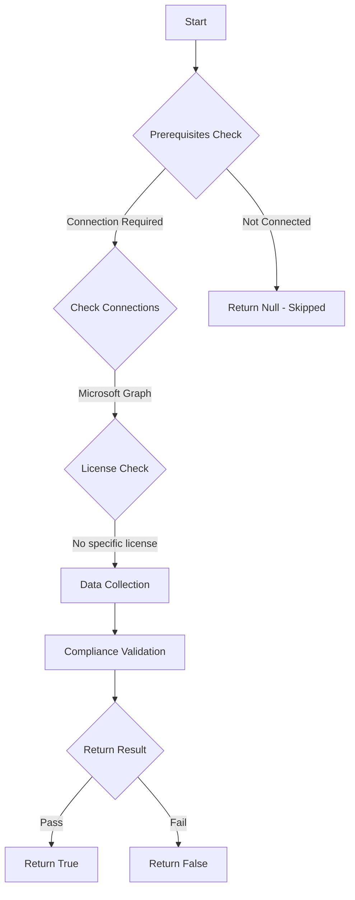

# CIS.M365.1.2.1: Checks if there are public groups

## Overview

**Function Name:** `Test-MtCis365PublicGroup`
**Category:** CIS
**Test Tag:** `CIS.M365.1.2.1`

## Description

Ensure that only organizationally managed and approved public groups exist
    CIS Microsoft 365 Foundations Benchmark v6.0.1

## Workflow

## Phase Details

### Phase 1: Prerequisites Check

**Required Connections:**
- Microsoft Graph

### Phase 2: Data Collection

**Graph API Calls:**
- `groups`

**Cmdlets/Functions Used:**
- `Invoke-MtGraphRequest`

### Phase 3: Compliance Validation

**Properties Checked:**

| Property | Expected Value |
| --- | --- |
| `visibility` | `Public` |

### Phase 4: Return Result

| Return Value | Meaning |
| --- | --- |
| `$true` | Compliant |
| `$false` | Non-Compliant |
| `$null` | Skipped (missing prerequisites, license, or error) |

## Original Documentation

1.2.1 (L2) Ensure that only organizationally managed/approved public groups exist

Microsoft 365 Groups is the foundational membership service that drives all teamwork across Microsoft 365. With Microsoft 365 Groups, you can give a group of people access to a collection of shared resources. When a new group is created in the
Administration panel, the default privacy value of the group is "Public". (In this case, ‘public’ means accessible to the identities within the organization without requiring group owner authorization to join.)
Ensure that Microsoft 365 Groups are set to **Private** in the Administration panel.

>Note: Although there are several different group types, this recommendation concerns Microsoft 365 Groups specifically.

#### Rationale

If group privacy is not controlled, any user may access sensitive information, depending on the group they try to access.
When the privacy value of a group is set to "Public," users may access data related to this group (e.g. SharePoint) via three methods:
1. The Azure Portal: Users can add themselves to the public group via the Azure Portal; however, administrators are notified when users access the Portal.
2. Access Requests: Users can request to join the group via the Groups application in the Access Panel. This provides the user with immediate access to the group, even though they are required to send a message to the group owner when
requesting to join.
3. SharePoint URL: Users can directly access a group via its SharePoint URL, which is usually guessable and can be found in the Groups application within the Access Panel.

#### Impact

If the recommendation is applied, group owners could receive more access requests than usual, especially regarding groups originally meant to be public.

#### Remediation action:

To enable only organizationally managed/approved public groups exist:
1. Navigate to Microsoft 365 admin center [https://admin.microsoft.com](https://admin.microsoft.com).
2. Click to expand **Teams & groups** select **Active teams & groups**.
3. On the **Active teams and groups** page, select the group's name that is public.
4. On the popup groups name page, **Select Settings**.
5. Under Privacy, select **Private**.

#### Related links

* [Microsoft 365 Admin Center](https://admin.microsoft.com)
* [Set up self-service group management in Microsoft Entra ID](https://learn.microsoft.com/en-us/entra/identity/users/groups-self-service-management)
* [Compare types of groups in Microsoft 365](https://learn.microsoft.com/en-us/microsoft-365/admin/create-groups/compare-groups?view=o365-worldwide)
* [CIS Microsoft 365 Foundations Benchmark v6.0.1 - Page 36](https://www.cisecurity.org/benchmark/microsoft_365)

<!--- Results --->
%TestResult%

## Standalone Function

See the standalone compliance check function: [`Test-MtCis365PublicGroupCompliance.ps1`](../../standalone-functions/CIS/Test-MtCis365PublicGroupCompliance.ps1)
