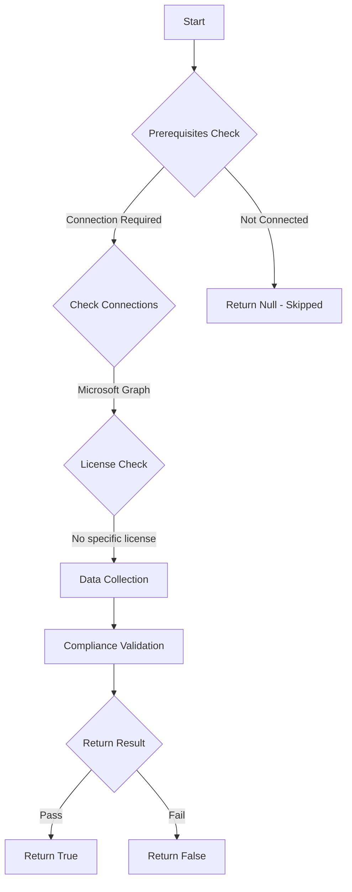

# CIS.M365.5.1.5.2: Checks if the admin consent workflow is enabled

## Overview

**Function Name:** `Test-MtCisAdminConsentWorkflowEnabled`
**Category:** CIS
**Test Tag:** `CIS.M365.5.1.5.2`

## Description

The admin consent workflow should be enabled.
        CIS Microsoft 365 Foundations Benchmark v6.0.1

## Workflow

## Phase Details

### Phase 1: Prerequisites Check

**Required Connections:**
- Microsoft Graph

### Phase 2: Data Collection

**Graph API Calls:**
- `policies/adminConsentRequestPolicy`

**Cmdlets/Functions Used:**
- `Invoke-MtGraphRequest`

### Phase 3: Compliance Validation

**Properties Checked:**

| Property | Expected Value |
| --- | --- |
| `isEnabled` | `$true` |

### Phase 4: Return Result

| Return Value | Meaning |
| --- | --- |
| `$true` | Compliant |
| `$false` | Non-Compliant |
| `$null` | Skipped (missing prerequisites, license, or error) |

## Original Documentation

5.1.5.2 (L1) Ensure the admin consent workflow is enabled

The admin consent workflow gives admins a secure way to grant access to applications that require admin approval. When a user tries to access an application but is unable to provide consent, they can send a request for admin approval. The request is sent via email to admins who have been designated as reviewers. A reviewer takes action on the request, and the user is notified of the action.

#### Rationale

The admin consent workflow (Preview) gives admins a secure way to grant access to applications that require admin approval. When a user tries to access an application but is unable to provide consent, they can send a request for admin approval. The request is sent via email to admins who have been designated as reviewers. A reviewer acts on the request, and the user is notified of the action.

#### Impact

To approve requests, a reviewer must be a global administrator, cloud application administrator, or application administrator. The reviewer must already have one of these admin roles assigned; simply designating them as a reviewer doesn't elevate their privileges.

#### Remediation action:

1. Navigate to [Microsoft Entra ID admin center](https://entra.microsoft.com).
2. Under **Entra ID** select **Enterprise apps**
3. Under **Security** select **Consent and permissions**
4. Under **Manage** select **Admin consent settings**
5. Set **Users can request admin consent to apps they are unable to consent to** to **Yes**
6. Click Save.

#### Related links

* [Microsoft Entra ID admin center](https://entra.microsoft.com)
* [Configure the admin consent workflow](https://learn.microsoft.com/en-us/entra/identity/enterprise-apps/configure-admin-consent-workflow)
* [CIS Microsoft 365 Foundations Benchmark v6.0.1 - Page 214](https://www.cisecurity.org/benchmark/microsoft_365)

<!--- Results --->
%TestResult%

## Standalone Function

See the standalone compliance check function: [`Test-MtCisAdminConsentWorkflowEnabledCompliance.ps1`](../../standalone-functions/CIS/Test-MtCisAdminConsentWorkflowEnabledCompliance.ps1)
