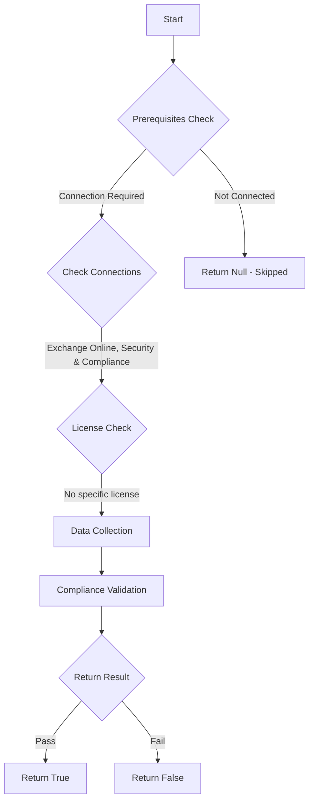

# CIS.M365.2.1.2: Checks if the default common attachment types filter is enabled

## Overview

**Function Name:** `Test-MtCisAttachmentFilter`
**Category:** CIS
**Test Tag:** `CIS.M365.2.1.2`

## Description

The common attachment types filter should be enabled
    CIS Microsoft 365 Foundations Benchmark v6.0.1

## Workflow



## Phase Details

### Phase 1: Prerequisites Check

**Required Connections:**
- Exchange Online
- Security & Compliance

### Phase 2: Data Collection

**Exchange Online Requests:**
- `MalwareFilterPolicy`

### Phase 3: Compliance Validation

**Properties Checked:**

| Property | Expected Value |
| --- | --- |
| `IsDefault` | `$true` |
| `EnableFileFilter` | `True` |

### Phase 4: Return Result

| Return Value | Meaning |
| --- | --- |
| `$true` | Compliant |
| `$false` | Non-Compliant |
| `$null` | Skipped (missing prerequisites, license, or error) |

## Original Documentation

2.1.2 (L1) Ensure the Common Attachment Types Filter is enabled

The Common Attachment Types Filter lets a user block known and custom malicious file types from being attached to emails.

#### Rationale

Blocking known malicious file types can help prevent malware-infested files from infecting a host.

#### Impact

Blocking common malicious file types should not cause an impact in modern computing environments.

#### Remediation action:

To enable the Common Attachment Types Filter:
1. Navigate to [Microsoft 365 Defender](https://security.microsoft.com).
2. Click to expand **Email & collaboration** select **Policies & rules**.
3. On the Policies & rules page select **Threat policies**.
4. Under polices select **Anti-malware** and click on the **Default (Default)** policy.
5. On the Policy page that appears on the right hand pane scroll to the bottom and click on **Edit protection settings**, check the **Enable the common attachments filter**.
6. Click Save.

##### PowerShell

1. Connect to Exchange Online using `Connect-ExchangeOnline`.
2. Run the following Exchange Online PowerShell command:
```powershell
Set-MalwareFilterPolicy -Identity Default -EnableFileFilter $true
```

>Note: Audit and Remediation guidance may focus on the Default policy however, if a Custom Policy exists in the organization's tenant, then ensure the setting is set as outlined in the highest priority policy listed.

#### Related links

* [Microsoft 365 Defender](https://security.microsoft.com)
* [Get-MalwareFilterPolicy](https://learn.microsoft.com/en-us/powershell/module/exchangepowershell/get-malwarefilterpolicy?view=exchange-ps)
* [Configure anti-malware policies for cloud mailboxes](https://learn.microsoft.com/en-us/defender-office-365/anti-malware-policies-configure?view=o365-worldwide)
* [CIS Microsoft 365 Foundations Benchmark v6.0.1 - Page 78](https://www.cisecurity.org/benchmark/microsoft_365)

<!--- Results --->
%TestResult%

## Standalone Function

See the standalone compliance check function: [`Test-MtCisAttachmentFilterCompliance.ps1`](../../standalone-functions/CIS/Test-MtCisAttachmentFilterCompliance.ps1)
