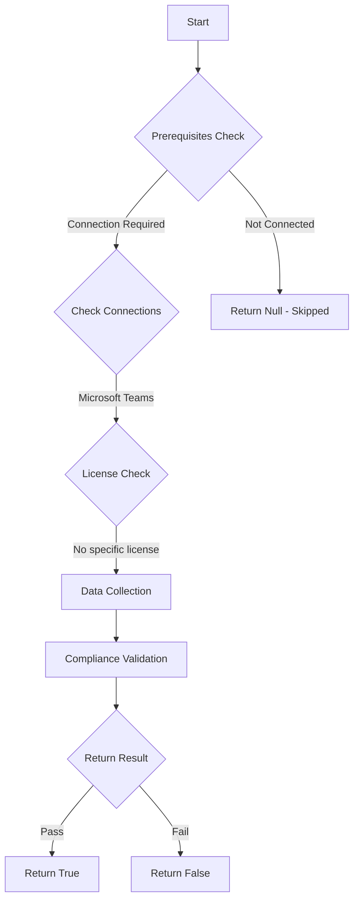

# CIS.M365.8.2.2: Ensure communication with unmanaged Teams users is disabled

## Overview

**Function Name:** `Test-MtCisCommunicateWithUnmanagedTeamsUsers`
**Category:** CIS
**Test Tag:** `CIS.M365.8.2.2`

## Description

Communication with unmanaged Teams users is disabled
    CIS Microsoft 365 Foundations Benchmark v6.0.1

## Workflow



## Phase Details

### Phase 1: Prerequisites Check

**Required Connections:**
- Microsoft Teams

### Phase 2: Data Collection

**Cmdlets/Functions Used:**
- `Get-CsTenantFederationConfiguration`
- `Get-CsExternalAccessPolicy`

### Phase 3: Compliance Validation

The function validates the collected data against compliance requirements.

### Phase 4: Return Result

| Return Value | Meaning |
| --- | --- |
| `$true` | Compliant |
| `$false` | Non-Compliant |
| `$null` | Skipped (missing prerequisites, license, or error) |

## Original Documentation

8.2.2 (L1) Ensure communication with unmanaged Teams users is disabled

This policy setting controls chats and meetings with external unmanaged Teams users (those not managed by an organization, such as Microsoft Teams (free)).

The recommended state is: **People in my organization can communicate with unmanaged Teams accounts set to Off**.

#### Rationale

Allowing users to communicate with unmanaged Teams users presents a potential security threat as little effort is required by threat actors to gain access to a trial or free Microsoft Teams account. Some real-world attacks and exploits delivered via Teams over external access channels include:
* DarkGate malware
* Social engineering / Phishing attacks by "Midnight Blizzard"
* GIFShell
* Username enumeration

#### Impact

Users will be unable to communicate with Teams users who are not managed by an organization. Organizations may choose to create additional policies for specific groups needing to communicate with unmanaged external users.

>Note: The settings that govern chats and meetings with external unmanaged Teams users aren't available in GCC, GCC High, or DOD deployments, or in private cloud environments

#### Remediation action:

To remediate using the UI:
1. Navigate to [Microsoft 365 Teams Admin Center](https://admin.teams.microsoft.com).
2. Click to expand **Users** select **External access**.
3. Select the **Policies** tab
4. Click on the **Global (Org-wide default)** policy.
5. Set **People in my organization can communicate with unmanaged Teams accounts** to **Off**.
6. Click **Save**.


##### PowerShell

1. Connect to Teams PowerShell using `Connect-MicrosoftTeams`.
2. Run the following command:
```powershell
Set-CsExternalAccessPolicy -Identity Global -EnableTeamsConsumerAccess $false
```

>Note: Configuring the organization settings to block communication is also in compliance with this control.


#### Related links

* [Microsoft 365 Teams Admin Center](https://admin.teams.microsoft.com)
* [IT Admins - Manage external meetings and chat with people and organizations using Microsoft identities](https://learn.microsoft.com/en-us/microsoftteams/trusted-organizations-external-meetings-chat?tabs=organization-settings)
* [Midnight Blizzard conducts targeted social engineering over Microsoft Teams](https://www.microsoft.com/en-us/security/blog/2023/08/02/midnight-blizzard-conducts-targeted-social-engineering-over-microsoft-teams/)
* [GIFShell Attack Lets Hackers Create Reverse Shell through Microsoft Teams GIFs](https://www.bitdefender.com/en-us/blog/hotforsecurity/gifshell-attack-lets-hackers-create-reverse-shell-through-microsoft-teams-gifs)
* [CIS Microsoft 365 Foundations Benchmark v6.0.1 - Page 413](https://www.cisecurity.org/benchmark/microsoft_365)

<!--- Results --->
%TestResult%

## Standalone Function

See the standalone compliance check function: [`Test-MtCisCommunicateWithUnmanagedTeamsUsersCompliance.ps1`](../../standalone-functions/CIS/Test-MtCisCommunicateWithUnmanagedTeamsUsersCompliance.ps1)
