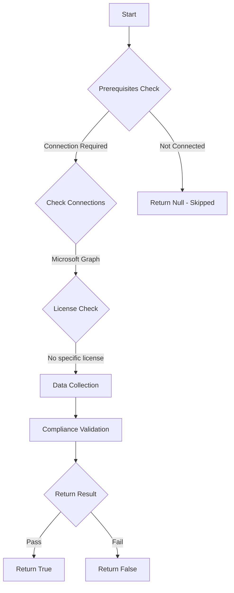

# CIS.M365.5.1.2.3: Checks if non-admin users are restricted from creating tenants

## Overview

**Function Name:** `Test-MtCisCreateTenantDisallowed`
**Category:** CIS
**Test Tag:** `CIS.M365.5.1.2.3`

## Description

Non-admin users should be restricted from creating tenants.
        CIS Microsoft 365 Foundations Benchmark v6.0.1

## Workflow



## Phase Details

### Phase 1: Prerequisites Check

**Required Connections:**
- Microsoft Graph

### Phase 2: Data Collection

**Graph API Calls:**
- `policies/authorizationPolicy`

**Cmdlets/Functions Used:**
- `Invoke-MtGraphRequest`

### Phase 3: Compliance Validation

**Properties Checked:**

| Property | Expected Value |
| --- | --- |
| `allowedToCreateTenants` | `$false` |

### Phase 4: Return Result

| Return Value | Meaning |
| --- | --- |
| `$true` | Compliant |
| `$false` | Non-Compliant |
| `$null` | Skipped (missing prerequisites, license, or error) |

## Original Documentation

5.1.2.3 (L1) Ensure 'Restrict non-admin users from creating tenants' is set to 'Yes'

Non-privileged users can create tenants in the Microsoft Entra ID and Microsoft Entra administration portal under "Manage tenant". The creation of a tenant is recorded in the Audit log as category "DirectoryManagement" and activity "Create Company". By default, the user who creates a Microsoft Entra tenant is automatically assigned the Global Administrator role. The newly created tenant doesn't inherit any settings or configurations.

#### Rationale

Restricting tenant creation prevents unauthorized or uncontrolled deployment of resources and ensures that the organization retains control over its infrastructure. User generation of shadow IT could lead to multiple, disjointed environments that can make it difficult for IT to manage and secure the organization's data, especially if other users in the organization began using these tenants for business purposes under the misunderstanding that they were secured by the organization's security team.

#### Impact

Non-admin users will need to contact I.T. if they have a valid reason to create a tenant.

#### Remediation action:

1. Navigate to [Microsoft 365 Entra admin center](https://entra.microsoft.com).
2. Click to expand **Entra ID** > **Users** > **User settings**.
3. Set **Restrict non-admin users from creating tenants** to **Yes** then **Save**.

##### PowerShell

1. Connect to Microsoft Graph using `Connect-MgGraph -Scopes "Policy.ReadWrite.Authorization"`
2. Run the following commands:
```powershell
# Create hashtable and update the auth policy
$params = @{ AllowedToCreateTenants = $false }
Update-MgPolicyAuthorizationPolicy -DefaultUserRolePermissions $params
```

#### Related links

* [Microsoft 365 Entra admin center](https://entra.microsoft.com)
* [Restrict member users' default permissions](https://learn.microsoft.com/en-us/entra/fundamentals/users-default-permissions#restrict-member-users-default-permissions)
* [CIS Microsoft 365 Foundations Benchmark v6.0.1 - Page 175](https://www.cisecurity.org/benchmark/microsoft_365)

<!--- Results --->
%TestResult%

## Standalone Function

See the standalone compliance check function: [`Test-MtCisCreateTenantDisallowedCompliance.ps1`](../../standalone-functions/CIS/Test-MtCisCreateTenantDisallowedCompliance.ps1)
