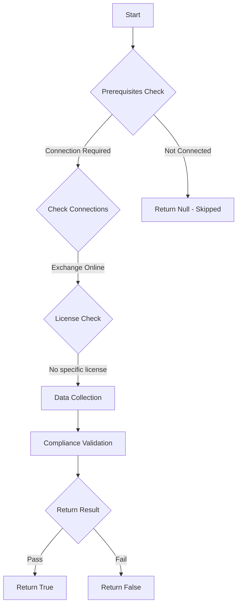

# CIS.M365.1.3.6: Checks if the customer lockbox feature is enabled

## Overview

**Function Name:** `Test-MtCisCustomerLockBox`
**Category:** CIS
**Test Tag:** `CIS.M365.1.3.6`

## Description

The customer lockbox feature should be enabled
    CIS Microsoft 365 Foundations Benchmark v6.0.1

## Workflow



## Phase Details

### Phase 1: Prerequisites Check

**Required Connections:**
- Exchange Online

### Phase 2: Data Collection

**Exchange Online Requests:**
- `OrganizationConfig`

### Phase 3: Compliance Validation

**Properties Checked:**

| Property | Expected Value |
| --- | --- |
| `CustomerLockBoxEnabled` | `True` |

### Phase 4: Return Result

| Return Value | Meaning |
| --- | --- |
| `$true` | Compliant |
| `$false` | Non-Compliant |
| `$null` | Skipped (missing prerequisites, license, or error) |

## Original Documentation

1.3.6 (L2) Ensure the customer lockbox feature is enabled

Customer Lockbox is a security feature that provides an additional layer of control and transparency to customer data in Microsoft 365. It offers an approval process for Microsoft support personnel to access organization data and creates an audited trail to meet compliance requirements.

#### Rationale

Enabling this feature protects organizational data against data spillage and exfiltration.

#### Impact

Administrators will need to grant Microsoft access to the tenant environment prior to a Microsoft engineer accessing the environment for support or troubleshooting.

#### Remediation action:

To enable the Customer Lockbox feature:
1. Navigate to Microsoft 365 admin center [https://admin.microsoft.com](https://admin.microsoft.com).
2. Click to expand **Settings** then select **Org settings**.
3. Select **Security & privacy** tab.
4. Click **Customer lockbox**.
5. Check the box **Require approval for all data access requests**.
6. Click **Save**.

##### PowerShell

1. Connect to Exchange Online using `Connect-ExchangeOnline`.
2. Run the following PowerShell command:
```powershell
Set-OrganizationConfig -CustomerLockBoxEnabled $true
```

#### Related links

* [Microsoft 365 Admin Center](https://admin.microsoft.com)
* [Turn Customer Lockbox requests on or off](https://learn.microsoft.com/en-us/purview/customer-lockbox-requests#turn-customer-lockbox-requests-on-or-off)
* [CIS Microsoft 365 Foundations Benchmark v6.0.1 - Page 61](https://www.cisecurity.org/benchmark/microsoft_365)

<!--- Results --->
%TestResult%

## Standalone Function

See the standalone compliance check function: [`Test-MtCisCustomerLockBoxCompliance.ps1`](../../standalone-functions/CIS/Test-MtCisCustomerLockBoxCompliance.ps1)
