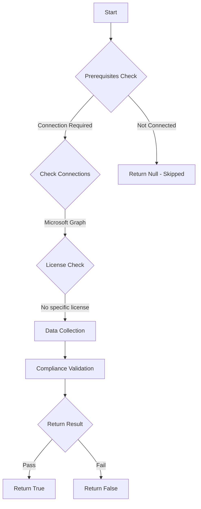

# CIS.M365.5.1.3.1: Checks if minimum one dynamic group exists with a membership rule targeting guest users.

## Overview

**Function Name:** `Test-MtCisEnsureGuestUserDynamicGroup`
**Category:** CIS
**Test Tag:** `CIS.M365.5.1.3.1`

## Description

There should be minimum one dynamic group with a membership rule targeting guest users to ensure that guest users are easily identifiable and can be managed effectively.
        CIS Microsoft 365 Foundations Benchmark v6.0.1

## Workflow



## Phase Details

### Phase 1: Prerequisites Check

**Required Connections:**
- Microsoft Graph

### Phase 2: Data Collection

**Graph API Calls:**
- `groups`

**Cmdlets/Functions Used:**
- `Invoke-MtGraphRequest`

### Phase 3: Compliance Validation

**Properties Checked:**

| Property | Expected Value |
| --- | --- |
| `groupTypes` | `DynamicMembership` |

### Phase 4: Return Result

| Return Value | Meaning |
| --- | --- |
| `$true` | Compliant |
| `$false` | Non-Compliant |
| `$null` | Skipped (missing prerequisites, license, or error) |

## Original Documentation

5.1.3.1 (L1) Ensure a dynamic group for guest users is created

A dynamic group is a dynamic configuration of security group membership for Microsoft Entra ID. Administrators can set rules to populate groups that are created in Entra ID based on user attributes (such as userType, department, or country/region). Members can be automatically added to or removed from a security group based on their attributes.

The recommended state is to create a dynamic group that includes guest accounts.

#### Rationale

Dynamic groups allow for an automated method to assign group membership.

Guest user accounts will be automatically added to this group and through this existing conditional access rules, access controls and other security measures will ensure that new guest accounts are restricted in the same manner as existing guest accounts.

#### Remediation action:

1. Navigate to [Microsoft 365 Entra admin center](https://entra.microsoft.com).
2. Click to expand **Identity** select **Groups**.
3. Click **All groups**
4. Select **New group** and assign the following values:
   - Group type: **Security**
   - Microsoft Entra roles can be assigned to the group: **No**
   - Membership type: **Dynamic User**
5. Click **Add dynamic query**.
6. Click **Edit** above the Rule Syntax box.
7. Enter `(user.userType -eq "Guest")`
8. Click **OK** and **Save**.

##### PowerShell

1. Connect to Microsoft Graph using `Connect-MgGraph -Scopes "Group.ReadWrite.All"`
2. In the script below edit DisplayName and MailNickname as needed and run:
```powershell
$params = @{
   DisplayName = "Dynamic Guest Group"
   MailNickname = "DynGuestUsers"
   MailEnabled = $false
   SecurityEnabled = $true
   GroupTypes = "DynamicMembership"
   MembershipRule = '(user.userType -eq "Guest")'
   MembershipRuleProcessingState = "On"
}
New-MgGroup @params
```

#### Related links

* [Microsoft 365 Entra admin center](https://entra.microsoft.com)
* [Create or update a dynamic membership group in Microsoft Entra ID](https://learn.microsoft.com/en-us/entra/identity/users/groups-create-rule)
* [Manage rules for dynamic membership groups in Microsoft Entra ID](https://learn.microsoft.com/en-us/entra/identity/users/groups-dynamic-membership)
* [Create and manage dynamic membership groups for B2B collaboration in Microsoft Entra External ID](https://learn.microsoft.com/en-us/entra/external-id/use-dynamic-groups)
* [CIS Microsoft 365 Foundations Benchmark v6.0.1 - Page 185](https://www.cisecurity.org/benchmark/microsoft_365)

<!--- Results --->
%TestResult%

## Standalone Function

See the standalone compliance check function: [`Test-MtCisEnsureGuestUserDynamicGroupCompliance.ps1`](../../standalone-functions/CIS/Test-MtCisEnsureGuestUserDynamicGroupCompliance.ps1)
