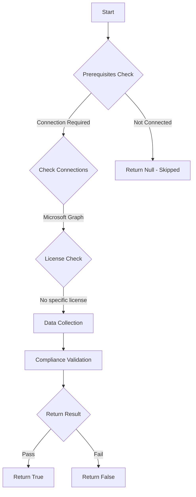

# CIS.M365.5.1.5.1: Checks if user consent to applications is disallowed.

## Overview

**Function Name:** `Test-MtCisEnsureUserConsentToAppsDisallowed`
**Category:** CIS
**Test Tag:** `CIS.M365.5.1.5.1`

## Description

Users should not be allowed to consent to applications.
        CIS Microsoft 365 Foundations Benchmark v6.0.1

## Workflow

## Phase Details

### Phase 1: Prerequisites Check

**Required Connections:**
- Microsoft Graph

### Phase 2: Data Collection

**Graph API Calls:**
- `policies/authorizationPolicy`

**Cmdlets/Functions Used:**
- `Invoke-MtGraphRequest`

### Phase 3: Compliance Validation

The function validates the collected data against compliance requirements.

### Phase 4: Return Result

| Return Value | Meaning |
| --- | --- |
| `$true` | Compliant |
| `$false` | Non-Compliant |
| `$null` | Skipped (missing prerequisites, license, or error) |

## Original Documentation

5.1.5.1 (L2) Ensure user consent to apps accessing company data on their behalf is not allowed

Control when end users and group owners are allowed to grant consent to applications, and when they will be required to request administrator review and approval. Allowing users to grant apps access to data helps them acquire useful applications and be productive but can represent a risk in some situations if it's not monitored and controlled carefully.

#### Rationale

Attackers commonly use custom applications to trick users into granting them access to company data. Restricting user consent mitigates this risk and helps to reduce the threat-surface.

#### Impact

If user consent is disabled, previous consent grants will still be honored but all future consent operations must be performed by an administrator. Tenant-wide admin consent can be requested by users through an integrated administrator consent request workflow or through organizational support processes

#### Remediation action:

1. Navigate to [Microsoft 365 Entra admin center](https://entra.microsoft.com).
2. Click to expand **Entra ID** and select **Enterprise apps**.
3. Under **Security** select **Consent and permissions** > **User consent settings**.
4. Under **User consent for applications** select **Do not allow user consent**.
5. Click the **Save** option at the top of the window.

#### Related links

* [Microsoft 365 Entra admin center](https://entra.microsoft.com)
* [Configure how users consent to applications](https://learn.microsoft.com/en-us/entra/identity/enterprise-apps/configure-user-consent?pivots=portal)
* [CIS Microsoft 365 Foundations Benchmark v6.0.1 - Page 211](https://www.cisecurity.org/benchmark/microsoft_365)

<!--- Results --->
%TestResult%

## Standalone Function

See the standalone compliance check function: [`Test-MtCisEnsureUserConsentToAppsDisallowedCompliance.ps1`](../../standalone-functions/CIS/Test-MtCisEnsureUserConsentToAppsDisallowedCompliance.ps1)
