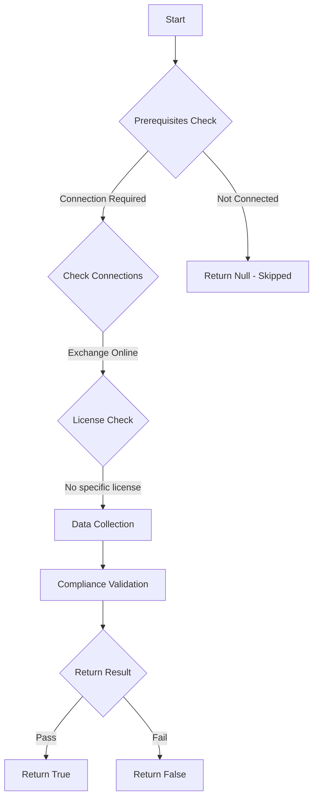

# CIS.M365.6.5.3: Checks if additional storage providers are restricted in Outlook on the web

## Overview

**Function Name:** `Test-MtCisExoAdditionalStorageProvider`
**Category:** CIS
**Test Tag:** `CIS.M365.6.5.3`

## Description

This setting allows users to open certain external files while working in Outlook on the web.
    If allowed, keep in mind that Microsoft doesn't control the use terms or privacy policies of
    those third-party services.
    CIS Microsoft 365 Foundations Benchmark v6.0.1
    6.5.3 (L2) Ensure additional storage providers are restricted in Outlook on the web (Automated)

## Workflow



## Phase Details

### Phase 1: Prerequisites Check

**Required Connections:**
- Exchange Online

### Phase 2: Data Collection

**Exchange Online Requests:**
- `OwaMailboxPolicy`

### Phase 3: Compliance Validation

**Properties Checked:**

| Property | Expected Value |
| --- | --- |
| `IsDefault` | `$true` |

### Phase 4: Return Result

| Return Value | Meaning |
| --- | --- |
| `$true` | Compliant |
| `$false` | Non-Compliant |
| `$null` | Skipped (missing prerequisites, license, or error) |

## Original Documentation

6.5.3 (L2) Ensure additional storage providers are restricted in Outlook on the web

This setting allows users to open certain external files while working in Outlook on the web. If allowed, keep in mind that Microsoft doesn't control the use terms or privacy policies of those third-party services.

Ensure **AdditionalStorageProvidersAvailable** is restricted on the default OWA policy.

#### Rationale

By default, additional storage providers are allowed in Office on the Web (such as Box, Dropbox, Facebook, Google Drive, OneDrive Personal, etc.). This could lead to information leakage and additional risk of infection from organizational non-trusted storage providers. Restricting this will inherently reduce risk as it will narrow opportunities for infection and data leakage.

#### Impact

The impact associated with this change is highly dependent upon current practices in the tenant. If users do not use other storage providers, then minimal impact is likely. However, if users do regularly utilize providers outside of the tenant this will affect their ability to continue to do so.

#### Remediation

##### PowerShell

1. Connect to Exchange Online using `Connect-ExchangeOnline`.
2. Run the following PowerShell command:

```powershell
Set-OwaMailboxPolicy -Identity OwaMailboxPolicy-Default -AdditionalStorageProvidersAvailable $false
```

#### Default Value

```txt
AdditionalStorageProvidersAvailable : True
```

#### Related links

* [Set-OwaMailboxPolicy](https://learn.microsoft.com/en-us/powershell/module/exchangepowershell/set-owamailboxpolicy?view=exchange-ps)
* [3rd party cloud storage services supported by Office apps](https://support.microsoft.com/en-us/office/3rd-party-cloud-storage-services-supported-by-office-apps-fce12782-eccc-4cf5-8f4b-d1ebec513f72)
* [Microsoft Secure Score - Restrict third-party storage services](https://security.microsoft.com/securescore)
* [CIS Microsoft 365 Foundations Benchmark v6.0.1 - Page 356](https://www.cisecurity.org/benchmark/microsoft_365)

<!--- Results --->
%TestResult%

## Standalone Function

See the standalone compliance check function: [`Test-MtCisExoAdditionalStorageProviderCompliance.ps1`](../../standalone-functions/CIS/Test-MtCisExoAdditionalStorageProviderCompliance.ps1)
