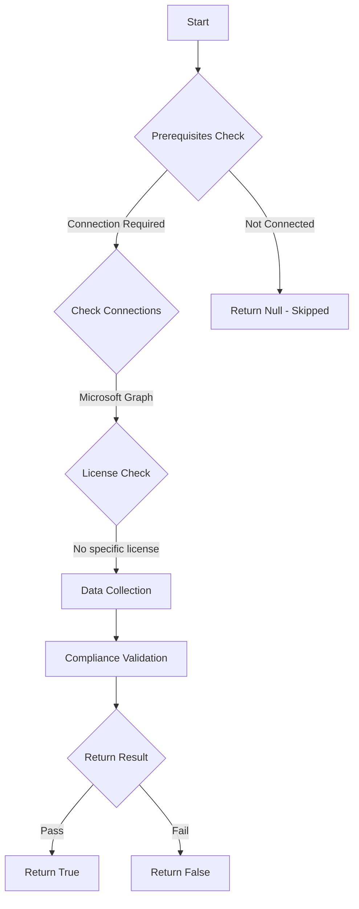

# CIS.M365.1.3.5: Checks if the internal phishing protection for Microsoft Forms is enabled.

## Overview

**Function Name:** `Test-MtCisFormsPhishingProtectionEnabled`
**Category:** CIS
**Test Tag:** `CIS.M365.1.3.5`

## Description

The internal phishing protection for Microsoft Forms should be enabled.
        CIS Microsoft 365 Foundations Benchmark v6.0.1

## Workflow



## Phase Details

### Phase 1: Prerequisites Check

**Required Connections:**
- Microsoft Graph

### Phase 2: Data Collection

**Cmdlets/Functions Used:**
- `Invoke-MtGraphRequest`

### Phase 3: Compliance Validation

**Properties Checked:**

| Property | Expected Value |
| --- | --- |
| `isInOrgFormsPhishingScanEnabled` | `$true` |

### Phase 4: Return Result

| Return Value | Meaning |
| --- | --- |
| `$true` | Compliant |
| `$false` | Non-Compliant |
| `$null` | Skipped (missing prerequisites, license, or error) |

## Original Documentation

1.3.5 (L1) Ensure internal phishing protection for Forms is enabled

Microsoft Forms can be used for phishing attacks by asking personal or sensitive information and collecting the results. Microsoft 365 has built-in protection that will proactively scan for phishing attempt in forms such personal information request.

#### Rationale

Enabling internal phishing protection for Microsoft Forms will prevent attackers using forms for phishing attacks by asking personal or other sensitive information and URLs.

#### Impact

If potential phishing was detected, the form will be temporarily blocked and cannot be distributed, and response collection will not happen until it is unblocked by the administrator or keywords were removed by the creator.

#### Remediation action:

1. Navigate to [Microsoft 365 admin center](https://admin.microsoft.com).
2. Click to expand **Settings** select **Org settings**.
3. In **Services** select **Microsoft Forms**
4. Enable **Add internal phishing protection** under **Phishing protection**
5. Click Save.

##### PowerShell

1. Connect to the Microsoft Graph service using `Connect-MgGraph -Scopes "OrgSettings-AppsAndServices.ReadWrite.All"`.
2. Run the following Microsoft Graph PowerShell commands:
```powershell
$uri = 'https://graph.microsoft.com/beta/admin/forms/settings'
$body = @{ "isInOrgFormsPhishingScanEnabled" = $true } | ConvertTo-Json
Invoke-MgGraphRequest -Method PATCH -Uri $uri -Body $body
```

#### Related links

* [Microsoft 365 admin center](https://admin.microsoft.com)
* [Administrator settings for Microsoft Forms](https://learn.microsoft.com/en-us/microsoft-forms/administrator-settings-microsoft-forms)
* [Review and unblock forms or users detected and blocked for potential phishing](https://learn.microsoft.com/en-us/microsoft-forms/review-unblock-forms-users-detected-blocked-potential-phishing)
* [CIS Microsoft 365 Foundations Benchmark v6.0.1 - Page 59](https://www.cisecurity.org/benchmark/microsoft_365)

<!--- Results --->
%TestResult%

## Standalone Function

See the standalone compliance check function: [`Test-MtCisFormsPhishingProtectionEnabledCompliance.ps1`](../../standalone-functions/CIS/Test-MtCisFormsPhishingProtectionEnabledCompliance.ps1)
