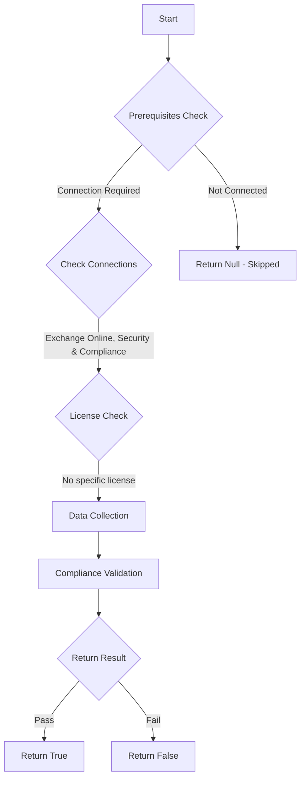

# CIS.M365.2.1.6: Checks if Exchange Online Spam Policies are set to notify administrators

## Overview

**Function Name:** `Test-MtCisOutboundSpamFilterPolicy`
**Category:** CIS
**Test Tag:** `CIS.M365.2.1.6`

## Description

Ensure Exchange Online Spam Policies are set to notify administrators
    CIS Microsoft 365 Foundations Benchmark v6.0.1

## Workflow



## Phase Details

### Phase 1: Prerequisites Check

**Required Connections:**
- Exchange Online
- Security & Compliance

### Phase 2: Data Collection

**Exchange Online Requests:**
- `HostedOutboundSpamFilterPolicy`

### Phase 3: Compliance Validation

**Properties Checked:**

| Property | Expected Value |
| --- | --- |
| `BccSuspiciousOutboundMail` | `True` |
| `NotifyOutboundSpam` | `True` |
| `IsDefault` | `$true` |

### Phase 4: Return Result

| Return Value | Meaning |
| --- | --- |
| `$true` | Compliant |
| `$false` | Non-Compliant |
| `$null` | Skipped (missing prerequisites, license, or error) |

## Original Documentation

2.1.6 (L1) Ensure Exchange Online Spam Policies are set to notify administrators

In Microsoft 365 organizations with mailboxes in Exchange Online or standalone Exchange Online Protection (EOP) organizations without Exchange Online mailboxes, email messages are automatically protected against spam (junk email) by EOP. Configure Exchange Online Spam Policies to copy emails and notify someone when a sender in the organization has been blocked for sending spam emails.

#### Rationale

A blocked account is a good indication that the account in question has been breached, and an attacker is using it to send spam emails to other people.

#### Impact

Notification of users that have been blocked should not cause an impact to the user.

#### Remediation action:

To set the Exchange Online Spam Policies:

1. Navigate to Microsoft 365 Defender [https://security.microsoft.com](https://security.microsoft.com)
2. Under **Email & collaboration** select **Policies & rules**
3. Select **Threat policies** then **Anti-spam**
4. Click on the **Anti-spam outbound policy (default)**
5. Select **Edit protection settings** then under **Notifications**
6. Check **Send a copy of outbound messages that exceed these limits to these users and groups** then enter the desired email addresses
7. Check **Notify these users and groups if a sender is blocked due to sending outbound spam** then enter the desired email addresses.
8. Click **Save**.

##### PowerShell

1. Connect to Exchange Online using `Connect-ExchangeOnline`.
2. Run the following PowerShell command:
```powershell
$BccEmailAddress = @("<INSERT-EMAIL>")
$NotifyEmailAddress = @("<INSERT-EMAIL>")
Set-HostedOutboundSpamFilterPolicy -Identity Default -BccSuspiciousOutboundAdditionalRecipients $BccEmailAddress -BccSuspiciousOutboundMail $true -NotifyOutboundSpam $true -NotifyOutboundSpamRecipients $NotifyEmailAddress
```

>Note: Audit and Remediation guidance may focus on the Default policy however, if a Custom Policy exists in the organization's tenant, then ensure the setting is set as outlined in the highest priority policy listed.

#### Related links

* [Microsoft 365 Defender](https://security.microsoft.com)
* [Outbound spam protection for cloud mailboxes](https://learn.microsoft.com/en-us/defender-office-365/outbound-spam-protection-about)
* [CIS Microsoft 365 Foundations Benchmark v6.0.1 - Page 91](https://www.cisecurity.org/benchmark/microsoft_365)

<!--- Results --->
%TestResult%

## Standalone Function

See the standalone compliance check function: [`Test-MtCisOutboundSpamFilterPolicyCompliance.ps1`](../../standalone-functions/CIS/Test-MtCisOutboundSpamFilterPolicyCompliance.ps1)
