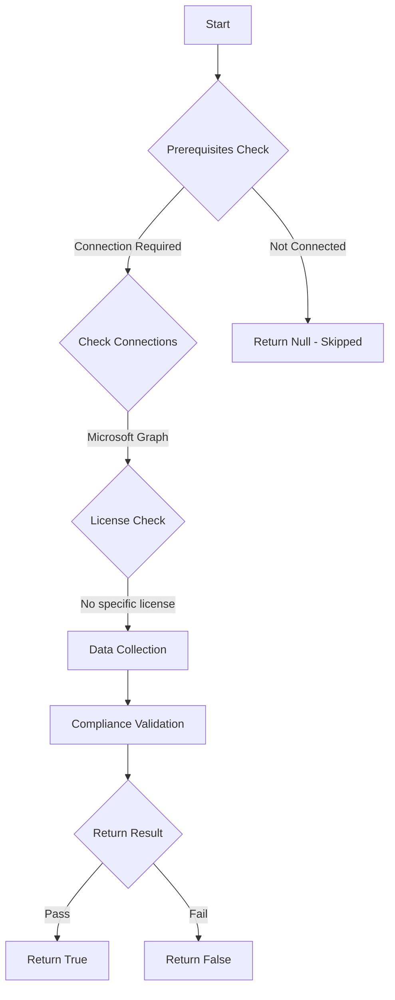

# CIS.M365.1.3.1: Checks if passwords are set to expire

## Overview

**Function Name:** `Test-MtCisPasswordExpiry`
**Category:** CIS
**Test Tag:** `CIS.M365.1.3.1`

## Description

Passwords should not be set to expire
    CIS Microsoft 365 Foundations Benchmark v6.0.1

## Workflow



## Phase Details

### Phase 1: Prerequisites Check

**Required Connections:**
- Microsoft Graph

### Phase 2: Data Collection

**Graph API Calls:**
- `domains`

**Cmdlets/Functions Used:**
- `Invoke-MtGraphRequest`

### Phase 3: Compliance Validation

The function validates the collected data against compliance requirements.

### Phase 4: Return Result

| Return Value | Meaning |
| --- | --- |
| `$true` | Compliant |
| `$false` | Non-Compliant |
| `$null` | Skipped (missing prerequisites, license, or error) |

## Original Documentation

1.3.1 (L1) Ensure the 'Password expiration policy' is set to 'Set passwords to never expire (recommended)'

Microsoft cloud-only accounts have a pre-defined password policy that cannot be changed. The only items that can change are the number of days until a password expires and whether or not passwords expire at all.

#### Rationale

Organizations such as NIST and Microsoft have updated their password policy recommendations to not arbitrarily require users to change their passwords after a specific amount of time, unless there is evidence that the password is compromised, or the user forgot it. They suggest this even for single factor (Password Only) use cases, with a reasoning that forcing arbitrary password changes on users actually make the passwords less secure. Other recommendations within this Benchmark suggest the use of MFA authentication for at least critical accounts (at minimum), which makes password expiration even less useful as well as password protection for Entra ID.

#### Impact

When setting passwords not to expire it is important to have other controls in place to supplement this setting. See below for related recommendations and user guidance.
* Ban common passwords.
* Educate users to not reuse organization passwords anywhere else.
* Enforce Multi-Factor Authentication registration for all users.

#### Remediation action:

To set Office 365 passwords are set to never expire:
1. Navigate to [Microsoft 365 admin center](https://admin.microsoft.com).
2. Click to expand **Settings** select **Org Settings**.
3. Click on **Security & privacy**.
4. Check the **Set passwords to never expire (recommended)** box.
5. Click **Save**.

##### PowerShell

1. Connect to the Microsoft Graph service using `Connect-MgGraph -Scopes "Domain.ReadWrite.All"`.
2. Run the following Microsoft Graph PowerShell command:
```powershell
Update-MgDomain -DomainId <Domain> -PasswordValidityPeriodInDays 2147483647
```

#### Related links

* [Microsoft 365 Admin Center](https://admin.microsoft.com)
* [NIST Special Publication 800-63B](https://pages.nist.gov/800-63-3/sp800-63b.html)
* [CIS Password Policy Guide](https://www.cisecurity.org/insights/white-papers/cis-password-policy-guide)
* [Password policy recommendations for Microsoft 365 passwords](https://learn.microsoft.com/en-us/microsoft-365/admin/misc/password-policy-recommendations?view=o365-worldwide)
* [CIS Microsoft 365 Foundations Benchmark v6.0.1 - Page 43](https://www.cisecurity.org/benchmark/microsoft_365)

<!--- Results --->
%TestResult%

## Standalone Function

See the standalone compliance check function: [`Test-MtCisPasswordExpiryCompliance.ps1`](../../standalone-functions/CIS/Test-MtCisPasswordExpiryCompliance.ps1)
