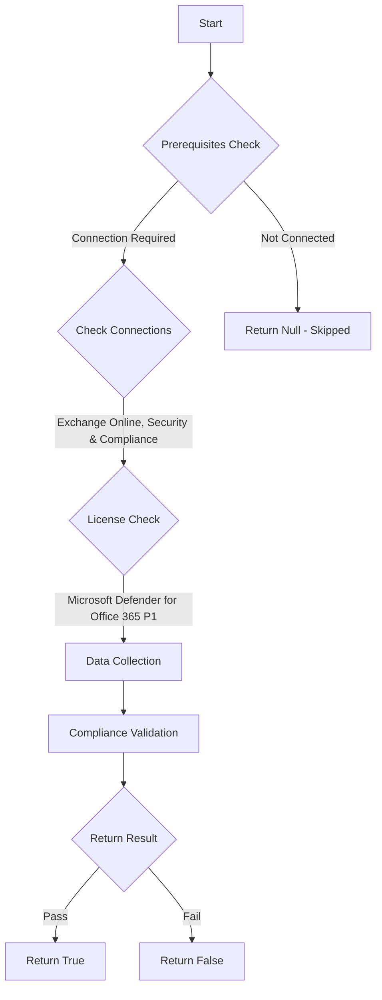

# CIS.M365.2.1.4: Checks if the Safe Attachments policy is enabled

## Overview

**Function Name:** `Test-MtCisSafeAttachment`
**Category:** CIS
**Test Tag:** `CIS.M365.2.1.4`

## Description

The Safe Attachments policy is enabled
    CIS Microsoft 365 Foundations Benchmark v6.0.1

## Workflow



## Phase Details

### Phase 1: Prerequisites Check

**Required Connections:**
- Exchange Online
- Security & Compliance

**Required Licenses:**
- Microsoft Defender for Office 365 P1

### Phase 2: Data Collection

**Exchange Online Requests:**
- `SafeAttachmentPolicy`

### Phase 3: Compliance Validation

**Properties Checked:**

| Property | Expected Value |
| --- | --- |
| `Enable` | `True` |
| `Action` | `Block` |
| `QuarantineTag` | `AdminOnlyAccessPolicy` |

### Phase 4: Return Result

| Return Value | Meaning |
| --- | --- |
| `$true` | Compliant |
| `$false` | Non-Compliant |
| `$null` | Skipped (missing prerequisites, license, or error) |

## Original Documentation

2.1.4 (L2) Ensure Safe Attachments policy is enabled

The Safe Attachments policy helps protect users from malware in email attachments by scanning attachments for viruses, malware, and other malicious content. When an email attachment is received by a user, Safe Attachments will scan the attachment in a secure environment and provide a verdict on whether the attachment is safe or not.

#### Rationale

Enabling Safe Attachments policy helps protect against malware threats in email attachments by analyzing suspicious attachments in a secure, cloud-based environment before they are delivered to the user's inbox. This provides an additional layer of security and can prevent new or unseen types of malware from infiltrating the organization's network.

#### Impact

Delivery of email with attachments may be delayed while scanning is occurring

#### Remediation action:

To enable the Safe Attachments policy:
1. Navigate to [Microsoft 365 Defender](https://security.microsoft.com).
2. Click to expand **E-mail & Collaboration** select **Policies & rules**.
3. On the Policies & rules page select **Threat policies**.
4. Under **Policies** select **Safe Attachments**.
5. Click + **Create**.
6. Create a Policy Name and Description, and then click **Next**.
7. Select all valid domains and click Next.
8. Select **Block**.
9. Quarantine policy is **AdminOnlyAccessPolicy**.
10. Leave **Enable redirect** unchecked.
11. Click **Next** and finally **Submit**.

##### PowerShell

1. Connect to Exchange Online using `Connect-ExchangeOnline`.
2. To change an existing policy modify the example below and run the following PowerShell command:
```powershell
Set-SafeAttachmentPolicy -Identity 'Example policy' -Action 'Block' -QuarantineTag 'AdminOnlyAccessPolicy' -Enable $true
```
3. Or, edit and run the below example to create a new safe attachments policy.
```powershell
New-SafeAttachmentPolicy -Name "CIS 2.1.4" -Enable $true -Action 'Block' -QuarantineTag 'AdminOnlyAccessPolicy'

New-SafeAttachmentRule -Name "CIS 2.1.4 Rule" -SafeAttachmentPolicy "CIS 2.1.4" -RecipientDomainIs 'exampledomain[.]com'
```

>Note: Policy targets such as users and domains should include domains, or groups that provide coverage for a majority of users in the organization. Different inclusion and exclusion use cases are not covered in the benchmark.

#### Related links

* [Microsoft 365 Defender](https://security.microsoft.com)
* [Safe Attachments in Microsoft Defender for Office 365](https://learn.microsoft.com/en-us/defender-office-365/safe-attachments-about)
* [Set up Safe Attachments policies in Microsoft Defender for Office 365](https://learn.microsoft.com/en-us/defender-office-365/safe-attachments-policies-configure)
* [CIS Microsoft 365 Foundations Benchmark v6.0.1 - Page 84](https://www.cisecurity.org/benchmark/microsoft_365)

<!--- Results --->
%TestResult%

## Standalone Function

See the standalone compliance check function: [`Test-MtCisSafeAttachmentCompliance.ps1`](../../standalone-functions/CIS/Test-MtCisSafeAttachmentCompliance.ps1)
