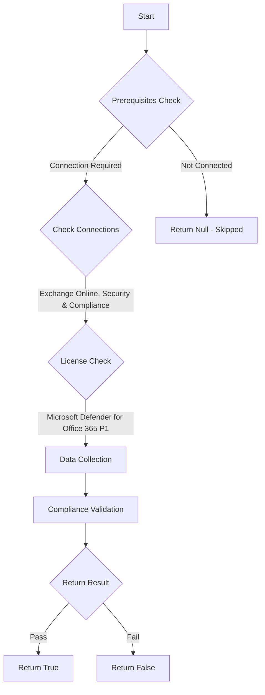

# CIS.M365.2.1.5: Checks if Safe Attachments for SharePoint, OneDrive, and Microsoft Teams are enabled

## Overview

**Function Name:** `Test-MtCisSafeAttachmentsAtpPolicy`
**Category:** CIS
**Test Tag:** `CIS.M365.2.1.5`

## Description

Safe Attachments for SharePoint, OneDrive, and Microsoft Teams should be enabled
    CIS Microsoft 365 Foundations Benchmark v6.0.1

## Workflow



## Phase Details

### Phase 1: Prerequisites Check

**Required Connections:**
- Exchange Online
- Security & Compliance

**Required Licenses:**
- Microsoft Defender for Office 365 P1

### Phase 2: Data Collection

**Exchange Online Requests:**
- `AtpPolicyForO365`

### Phase 3: Compliance Validation

**Properties Checked:**

| Property | Expected Value |
| --- | --- |
| `EnableATPForSPOTeamsODB` | `True` |
| `EnableSafeDocs` | `True` |
| `AllowSafeDocsOpen` | `False` |

### Phase 4: Return Result

| Return Value | Meaning |
| --- | --- |
| `$true` | Compliant |
| `$false` | Non-Compliant |
| `$null` | Skipped (missing prerequisites, license, or error) |

## Original Documentation

2.1.5 (L2) Ensure Safe Attachments for SharePoint, OneDrive, and Microsoft Teams is Enabled

Safe Attachments for SharePoint, OneDrive, and Microsoft Teams scans these services for malicious files.

#### Rationale

Safe Attachments for SharePoint, OneDrive, and Microsoft Teams protect organizations from inadvertently sharing malicious files. When a malicious file is detected that file is blocked so that no one can open, copy, move, or share it until further actions are taken by the organization's security team.

#### Impact

Impact associated with Safe Attachments is minimal, and equivalent to impact associated with anti-virus scanners in an environment.


#### Remediation action:

To enable Safe Attachments for SharePoint, OneDrive, and Microsoft Teams:

1. Navigate to Microsoft 365 Defender [https://security.microsoft.com](https://security.microsoft.com)
2. Under **Email & collaboration** select **Policies & rules**
3. Select **Threat policies** then **Safe Attachments**
4. Click on **Global settings**
5. Click to **Enable Turn on Defender for Office 365 for SharePoint, OneDrive, and Microsoft Teams**
6. Click to **Enable Turn on Safe Documents for Office clients**
7. Click to **Disable Allow people to click through Protected View even if Safe Documents identified the file as malicious**
8. Click **Save**.

##### PowerShell

1. Connect to Exchange Online using `Connect-ExchangeOnline`.
2. Run the following PowerShell command:
```powershell
Set-AtpPolicyForO365 -EnableATPForSPOTeamsODB $true -EnableSafeDocs $true -AllowSafeDocsOpen $false
```

#### Related links

* [Microsoft 365 Defender](https://security.microsoft.com)
* [Safe Attachments for SharePoint, OneDrive, and Microsoft Teams](https://learn.microsoft.com/en-us/defender-office-365/safe-attachments-for-spo-odfb-teams-about)
* [CIS Microsoft 365 Foundations Benchmark v6.0.1 - Page 88](https://www.cisecurity.org/benchmark/microsoft_365)

<!--- Results --->
%TestResult%

## Standalone Function

See the standalone compliance check function: [`Test-MtCisSafeAttachmentsAtpPolicyCompliance.ps1`](../../standalone-functions/CIS/Test-MtCisSafeAttachmentsAtpPolicyCompliance.ps1)
