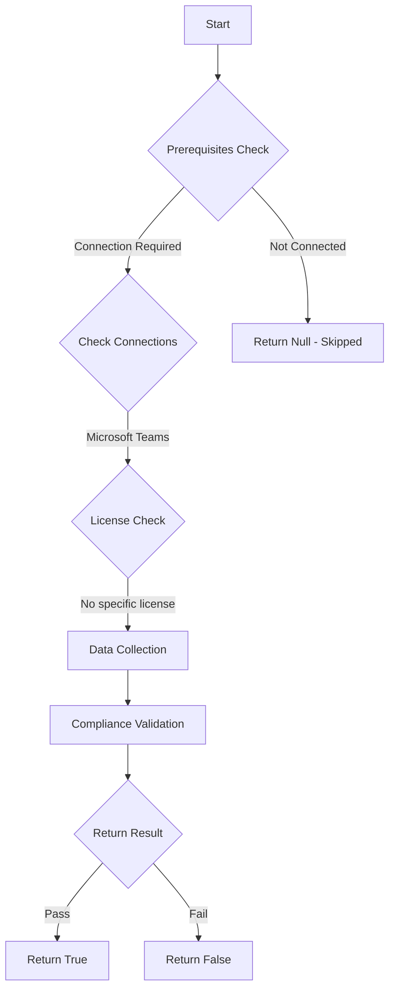

# CIS.M365.8.5.3: Ensure only people in my org can bypass the lobby

## Overview

**Function Name:** `Test-MtCisTeamsLobbyBypass`
**Category:** CIS
**Test Tag:** `CIS.M365.8.5.3`

## Description

Only people in my org can bypass the lobby
    CIS Microsoft 365 Foundations Benchmark v6.0.1

## Workflow



## Phase Details

### Phase 1: Prerequisites Check

**Required Connections:**
- Microsoft Teams

### Phase 2: Data Collection

**Cmdlets/Functions Used:**
- `Get-CsTeamsMeetingPolicy`

### Phase 3: Compliance Validation

The function validates the collected data against compliance requirements.

### Phase 4: Return Result

| Return Value | Meaning |
| --- | --- |
| `$true` | Compliant |
| `$false` | Non-Compliant |
| `$null` | Skipped (missing prerequisites, license, or error) |

## Original Documentation

8.5.3 (L1) Ensure only people in my org can bypass the lobby

This policy setting controls who can join a meeting directly and who must wait in the lobby until they're admitted by an organizer, co-organizer, or presenter of the meeting.

The recommended state is **People who were invited** or more restrictive.

#### Rationale

For meetings that could contain sensitive information, it is best to allow the meeting organizer to vet anyone not directly sent an invite before admitting them to the meeting. This will also prevent the anonymous user from using the meeting link to have meetings at unscheduled times.

#### Impact

Individuals who are not part of the organization will have to wait in the lobby until they're admitted by an organizer, co-organizer, or presenter of the meeting.

Any individual who dials into the meeting regardless of status will also have to wait in the lobby. This includes internal users who are considered unauthenticated when dialing in.

#### Remediation action:

1. Navigate to [Microsoft Teams Admin Center](https://admin.teams.microsoft.com).
2. Select **Settings & policies** > **Global (Org-wide default) settings**.
3. Select **Meetings** to open the **meeting settings** section.
4. Under meeting join & lobby set **Who can bypass the lobby** to **People who were invited** or a more restrictive value: **People in my org, Only organizers and co-organizers**.

##### PowerShell

1. Connect to Teams PowerShell using `Connect-MicrosoftTeams`.
2. Run the following command to set the recommended state:
```powershell
Set-CsTeamsMeetingPolicy -Identity Global -AutoAdmittedUsers "InvitedUsers"
```

>Note: More restrictive values EveryoneInCompanyExcludingGuests or OrganizerOnly are also in compliance.

#### Related links

* [Microsoft Teams Admin Center](https://admin.teams.microsoft.com).
* [Overview of lobby settings and policies](https://learn.microsoft.com/en-us/microsoftteams/who-can-bypass-meeting-lobby#overview-of-lobby-settings-and-policies)
* [Set-CsTeamsMeetingPolicy](https://learn.microsoft.com/en-us/powershell/module/microsoftteams/set-csteamsmeetingpolicy?view=teams-ps&viewFallbackFrom=skype-ps)
* [CIS Microsoft 365 Foundations Benchmark v6.0.1 - Page 434](https://www.cisecurity.org/benchmark/microsoft_365)

<!--- Results --->
%TestResult%

## Standalone Function

See the standalone compliance check function: [`Test-MtCisTeamsLobbyBypassCompliance.ps1`](../../standalone-functions/CIS/Test-MtCisTeamsLobbyBypassCompliance.ps1)
