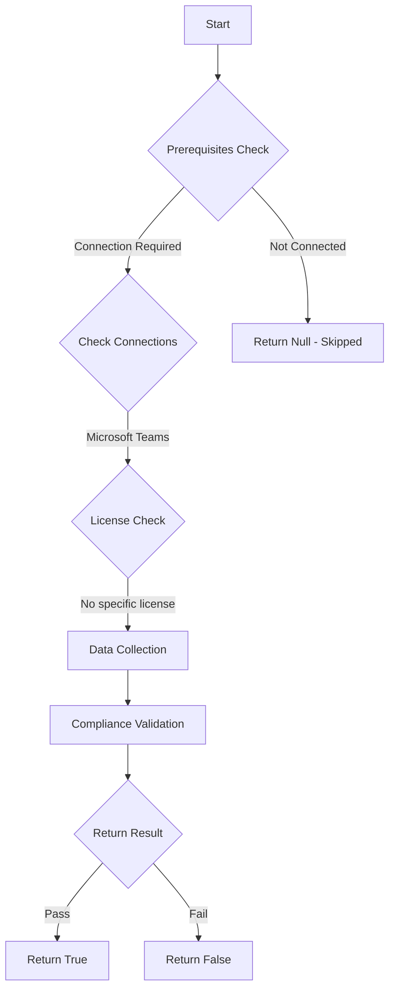

# CIS: Ensure all or a majority of third-party and custom apps are blocked

## Overview

**Function Name:** `Test-MtCisThirdPartyAndCustomApps`
**Category:** CIS
**Test Tag:** `CIS`

## Description

Ensure all or a majority of third-party and custom apps are blocked
    CIS Microsoft 365 Foundations Benchmark v6.0.1

## Workflow

## Phase Details

### Phase 1: Prerequisites Check

**Required Connections:**
- Microsoft Teams

### Phase 2: Data Collection

**Cmdlets/Functions Used:**
- `Get-CsTeamsAppPermissionPolicy`

### Phase 3: Compliance Validation

The function validates the collected data against compliance requirements.

### Phase 4: Return Result

| Return Value | Meaning |
| --- | --- |
| `$true` | Compliant |
| `$false` | Non-Compliant |
| `$null` | Skipped (missing prerequisites, license, or error) |

## Original Documentation

8.4.1 (L1) Ensure app permission policies are configured

This policy setting controls which class of apps are available for users to install.

#### Rationale

Allowing users to install third-party or unverified apps poses a potential risk of introducing malicious software to the environment.

#### Impact

Users will only be able to install approved classes of apps.

#### Remediation action:

1. Navigate to [Microsoft Teams Admin Center](https://admin.teams.microsoft.com).
2. Click to expand **Teams apps** select **Manage apps**.
3. In the upper right click **Actions** > ***Org-wide app settings***.
4. For **Microsoft apps** set **Let users install and use available apps by default** to **On** or less permissive.
5. For **Third-party apps** set **Let users install and use available apps by default** to **Off**.
6. For **Custom apps** set **Let users install and use available apps by default** to **Off**.
7. For **Custom apps** set **Let users interact with custom apps in preview** to **Off**.

#### Related links

* [Microsoft Teams Admin Center](https://admin.teams.microsoft.com).
* [Use app centric management to manage access to apps](https://learn.microsoft.com/en-us/microsoftteams/app-centric-management)
* [Disabling non-Microsoft and custom apps](https://learn.microsoft.com/en-us/defender-office-365/step-by-step-guides/reducing-attack-surface-in-microsoft-teams?view=o365-worldwide#disabling-third-party--custom-apps)
* [CIS Microsoft 365 Foundations Benchmark v6.0.1 - Page 425](https://www.cisecurity.org/benchmark/microsoft_365)

<!--- Results --->
%TestResult%

## Standalone Function

See the standalone compliance check function: [`Test-MtCisThirdPartyAndCustomAppsCompliance.ps1`](../../standalone-functions/CIS/Test-MtCisThirdPartyAndCustomAppsCompliance.ps1)
