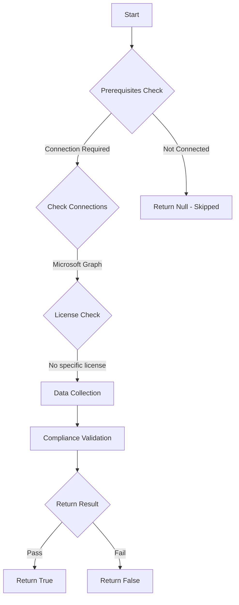

# CIS.M365.5.1.2.2: Checks if users are not allowed to register applications.

## Overview

**Function Name:** `Test-MtCisThirdPartyApplicationsDisallowed`
**Category:** CIS
**Test Tag:** `CIS.M365.5.1.2.2`

## Description

Users should not be allowed to register applications in the tenant.
        CIS Microsoft 365 Foundations Benchmark v6.0.1

## Workflow



## Phase Details

### Phase 1: Prerequisites Check

**Required Connections:**
- Microsoft Graph

### Phase 2: Data Collection

**Graph API Calls:**
- `policies/authorizationPolicy`

**Cmdlets/Functions Used:**
- `Invoke-MtGraphRequest`

### Phase 3: Compliance Validation

**Properties Checked:**

| Property | Expected Value |
| --- | --- |
| `allowedToCreateApps` | `$false` |

### Phase 4: Return Result

| Return Value | Meaning |
| --- | --- |
| `$true` | Compliant |
| `$false` | Non-Compliant |
| `$null` | Skipped (missing prerequisites, license, or error) |

## Original Documentation

5.1.2.2 (L2) Ensure third party integrated applications are not allowed

App registration allows users to register custom-developed applications for use within the directory.

#### Rationale

Third-party integrated applications connection to services should be disabled unless there is a very clear value and robust security controls are in place. While there are legitimate uses, attackers can grant access from breached accounts to third party applications to exfiltrate data from your tenancy without having to maintain the breached account.

#### Impact

The implementation of this change will impact both end users and administrators. End users will not be able to integrate third-party applications that they may wish to use. Administrators are likely to receive requests from end users to grant them permission to the necessary third-party applications.

#### Remediation action:

1. Navigate to [Microsoft 365 Entra admin center](https://entra.microsoft.com).
2. Click to expand **Entra ID** > **Users** select **Users settings**.
3. Set **Users can register applications** to **No**.
4. Click **Save**.

##### PowerShell

1. Connect to Microsoft Graph using `Connect-MgGraph -Scopes "Policy.ReadWrite.Authorization"`
2. Run the following commands:
```powershell
$param = @{ AllowedToCreateApps = "$false" }
Update-MgPolicyAuthorizationPolicy -DefaultUserRolePermissions $param
```

#### Related links

* [Microsoft 365 Entra admin center](https://entra.microsoft.com)
* [How and why applications are added to Microsoft Entra ID](https://learn.microsoft.com/en-us/entra/identity-platform/how-applications-are-added)
* [CIS Microsoft 365 Foundations Benchmark v6.0.1 - Page 173](https://www.cisecurity.org/benchmark/microsoft_365)

<!--- Results --->
%TestResult%

## Standalone Function

See the standalone compliance check function: [`Test-MtCisThirdPartyApplicationsDisallowedCompliance.ps1`](../../standalone-functions/CIS/Test-MtCisThirdPartyApplicationsDisallowedCompliance.ps1)
