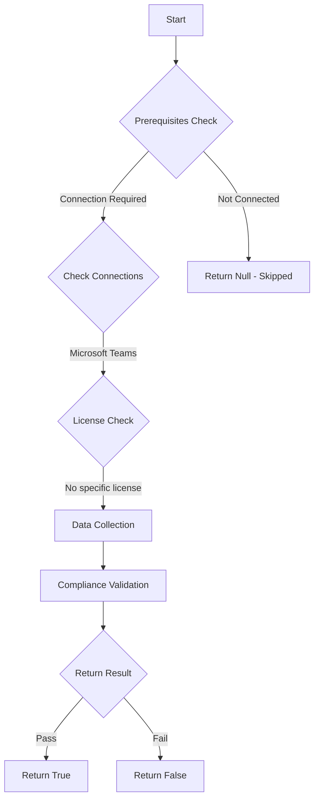

# CIS: Ensure third-party file sharing cloud services in Teams are disabled

## Overview

**Function Name:** `Test-MtCisThirdPartyFileSharing`
**Category:** CIS
**Test Tag:** `CIS`

## Description

Ensure third-party file sharing cloud services in Teams are disabled
    CIS Microsoft 365 Foundations Benchmark v6.0.1

## Workflow



## Phase Details

### Phase 1: Prerequisites Check

**Required Connections:**
- Microsoft Teams

### Phase 2: Data Collection

**Cmdlets/Functions Used:**
- `Get-CsTeamsClientConfiguration`

### Phase 3: Compliance Validation

The function validates the collected data against compliance requirements.

### Phase 4: Return Result

| Return Value | Meaning |
| --- | --- |
| `$true` | Compliant |
| `$false` | Non-Compliant |
| `$null` | Skipped (missing prerequisites, license, or error) |

## Original Documentation

8.1.1 (L2) Ensure external file sharing in Teams is enabled for only approved cloud storage services

Microsoft Teams enables collaboration via file sharing. This file sharing is conducted within Teams, using SharePoint Online, by default; however, third-party cloud services are allowed as well.

>Note: Skype for business is deprecated as of July 31, 2021 although these settings may still be valid for a period of time. See the link in the references section for more information.

#### Rationale

Ensuring that only authorized cloud storage providers are accessible from Teams will
help to dissuade the use of non-approved storage providers.

#### Impact

The impact associated with this change is highly dependent upon current practices in the tenant. If users do not use other storage providers, then minimal impact is likely. However, if users do regularly utilize providers outside of the tenant this will affect their ability to continue to do so.

#### Remediation action:

To change third-party cloud services using the UI:
1. Navigate to **Microsoft Teams admin center** [https://admin.teams.microsoft.com](https://admin.teams.microsoft.com).
2. Select **Settings & policies > Global (Org-wide default) settings.**
3. Click **Teams** to open the **Teams settings** section.
4. Under files set storages providers to **Off** unless they have first been authorized by the organization.

To change third-party cloud services using PowerShell:
1. Connect to Teams using **Connect-MicrosoftTeams**.
2. Run the following PowerShell command to disable external providers that are not authorized. (the example disables Citrix Files, DropBox, Box, Google Drive and Egnyte)

```
$Params = @{
 Identity = 'Global'
 AllowGoogleDrive = $false
 AllowShareFile = $false
 AllowBox = $false
 AllowDropBox = $false
 AllowEgnyte = $false
}
Set-CsTeamsClientConfiguration @Params
```

#### Related links

* [Microsoft 365 Admin Center](https://admin.microsoft.com)
* [Microsoft Teams Admin Center](https://admin.teams.microsoft.com).
* [Manage Teams with Microsoft Teams PowerShell](https://learn.microsoft.com/en-us/microsoftteams/teams-powershell-managing-teams)
* [CIS Microsoft 365 Foundations Benchmark v6.0.1 - Page 401](https://www.cisecurity.org/benchmark/microsoft_365)

<!--- Results --->
%TestResult%

## Standalone Function

See the standalone compliance check function: [`Test-MtCisThirdPartyFileSharingCompliance.ps1`](../../standalone-functions/CIS/Test-MtCisThirdPartyFileSharingCompliance.ps1)
