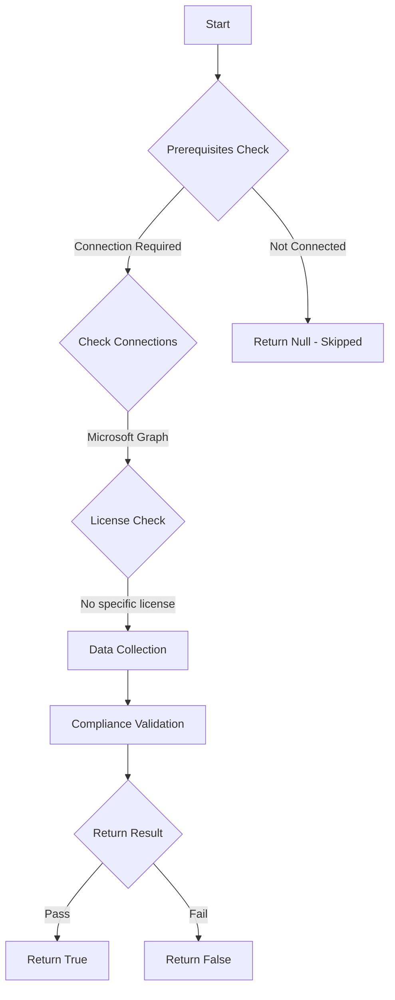

# CIS.M365.1.3.7: Checks if users are restricted to store and share files in third-party storage services in Microsoft 365 on the web.

## Overview

**Function Name:** `Test-MtCisThirdPartyStorageServicesRestricted`
**Category:** CIS
**Test Tag:** `CIS.M365.1.3.7`

## Description

Users should be restricted to store and share files in third-party storage services in Microsoft 365 on the web.
        CIS Microsoft 365 Foundations Benchmark v6.0.1

## Workflow



## Phase Details

### Phase 1: Prerequisites Check

**Required Connections:**
- Microsoft Graph

### Phase 2: Data Collection

**Graph API Calls:**
- `servicePrincipals`

**Cmdlets/Functions Used:**
- `Invoke-MtGraphRequest`

### Phase 3: Compliance Validation

The function validates the collected data against compliance requirements.

### Phase 4: Return Result

| Return Value | Meaning |
| --- | --- |
| `$true` | Compliant |
| `$false` | Non-Compliant |
| `$null` | Skipped (missing prerequisites, license, or error) |

## Original Documentation

1.3.7 (L2) Ensure 'third-party storage services' are restricted in 'Microsoft 365 on the web'

Third-party storage can be enabled for users in Microsoft 365, allowing them to store and share documents using services such as Dropbox, alongside OneDrive and team sites.

Ensure **Microsoft 365 on the web** third-party storage services are restricted.

#### Rationale

By using external storage services an organization may increase the risk of data breaches and unauthorized access to confidential information. Additionally, third-party services may not adhere to the same security standards as the organization, making it difficult to maintain data privacy and security.

#### Impact

Impact associated with this change is highly dependent upon current practices in the tenant. If users do not use other storage providers, then minimal impact is likely. However, if users do regularly utilize providers outside of the tenant this will affect their ability to continue to do so.

#### Remediation action:

1. Navigate to [Microsoft 365 admin center](https://admin.microsoft.com)
2. Go to **Settings** > **Org Settings** > **Services** > **Microsoft 365 on the web**
3. Uncheck **Let users open files stored in third-party storage services in Microsoft 365 on the web**

##### PowerShell

1. Connect to Microsoft Graph using `Connect-MgGraph -Scopes "Application.ReadWrite.All"`
2. Run the following script:
```powershell
$SP = Get-MgServicePrincipal -Filter "appId eq 'c1f33bc0-bdb4-4248-ba9b096807ddb43e'"
# If the service principal doesn't exist then create it first.
if (-not $SP) {
    $SP = New-MgServicePrincipal -AppId "c1f33bc0-bdb4-4248-ba9b096807ddb43e"
}
Update-MgServicePrincipal -ServicePrincipalId $SP.Id -AccountEnabled:$false
```

#### Related links

* [Microsoft 365 admin center](https://admin.microsoft.com)
* [CIS Microsoft 365 Foundations Benchmark v6.0.1 - Page 63](https://www.cisecurity.org/benchmark/microsoft_365)

<!--- Results --->
%TestResult%

## Standalone Function

See the standalone compliance check function: [`Test-MtCisThirdPartyStorageServicesRestrictedCompliance.ps1`](../../standalone-functions/CIS/Test-MtCisThirdPartyStorageServicesRestrictedCompliance.ps1)
