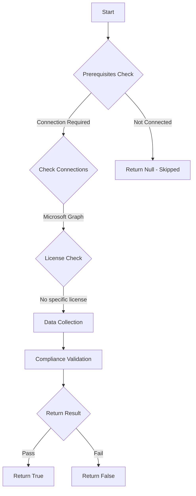

# CIS.M365.1.3.4: Checks if users are restricted to install add-ins from the Office Store and start trials on behalf of the organization.

## Overview

**Function Name:** `Test-MtCisUserOwnedAppsRestricted`
**Category:** CIS
**Test Tag:** `CIS.M365.1.3.4`

## Description

Users should be restricted to install add-ins from the Office Store and start trials on behalf of the organization.
    CIS Microsoft 365 Foundations Benchmark v6.0.1

## Workflow



## Phase Details

### Phase 1: Prerequisites Check

**Required Connections:**
- Microsoft Graph

### Phase 2: Data Collection

**Cmdlets/Functions Used:**
- `Invoke-MtGraphRequest`

### Phase 3: Compliance Validation

**Properties Checked:**

| Property | Expected Value |
| --- | --- |
| `isOfficeStoreEnabled` | `$false` |
| `isAppAndServicesTrialEnabled` | `$false` |

### Phase 4: Return Result

| Return Value | Meaning |
| --- | --- |
| `$true` | Compliant |
| `$false` | Non-Compliant |
| `$null` | Skipped (missing prerequisites, license, or error) |

## Original Documentation

1.3.4 (L1) Ensure 'User owned apps and services' is restricted

By default, users can install add-ins in their Microsoft Word, Excel, and PowerPoint applications, allowing data access within the application.

Do not allow users to install add-ins in Word, Excel, or PowerPoint.

#### Rationale

Attackers commonly use vulnerable and custom-built add-ins to access data in user applications.

While allowing users to install add-ins by themselves does allow them to easily acquire useful add-ins that integrate with Microsoft applications, it can represent a risk if not used and monitored carefully.

Disable future user's ability to install add-ins in Microsoft Word, Excel, or PowerPoint helps reduce your threat-surface and mitigate this risk.

#### Impact

Implementation of this change will impact both end users and administrators. End users will not be able to install add-ins that they may want to install.

#### Remediation action:

1. Navigate to [Microsoft 365 admin center](https://admin.microsoft.com).
2. Click to expand **Settings** select **Org settings**.
3. In **Services** select **User owned apps and services.**
4. Uncheck **Let users access the Office Store** and **Let users start trials on behalf of your organization**
5. Click **Save**.

##### PowerShell

1. Connect to the Microsoft Graph service using `Connect-MgGraph -Scopes "OrgSettings-AppsAndServices.ReadWrite.All"`.
2. Run the following Microsoft Graph PowerShell commands:
```powershell
$uri = "https://graph.microsoft.com/beta/admin/appsAndServices"
$body = @{
    "Settings" = @{
        "isAppAndServicesTrialEnabled" = $false
        "isOfficeStoreEnabled" = $false
    }
} | ConvertTo-Json
Invoke-MgGraphRequest -Method PATCH -Uri $uri -Body $body
```

#### Related links

* [Microsoft 365 admin center](https://admin.microsoft.com)
* [Manage add-ins in the Microsoft 365 admin center](https://learn.microsoft.com/en-us/microsoft-365/admin/manage/manage-addins-in-the-admin-center?view=o365-worldwide&tabs=word-excel-powerpoint#manage-add-in-downloads-by-turning-onoff-the-office-store-across-all-apps-except-outlook)
* [CIS Microsoft 365 Foundations Benchmark v6.0.1 - Page 56](https://www.cisecurity.org/benchmark/microsoft_365)

<!--- Results --->
%TestResult%

## Standalone Function

See the standalone compliance check function: [`Test-MtCisUserOwnedAppsRestrictedCompliance.ps1`](../../standalone-functions/CIS/Test-MtCisUserOwnedAppsRestrictedCompliance.ps1)
