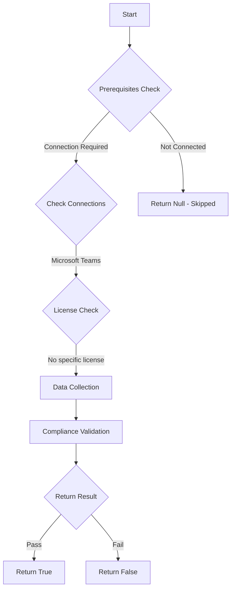

# CIS.M365.2.4.4: Checks if the Zero-hour auto purge (ZAP) for Microsoft Teams is enabled

## Overview

**Function Name:** `Test-MtCisZAP`
**Category:** CIS
**Test Tag:** `CIS.M365.2.4.4`

## Description

Zero-hour auto purge (ZAP) should be enabled for Microsoft Teams
    CIS Microsoft 365 Foundations Benchmark v6.0.1

## Workflow



## Phase Details

### Phase 1: Prerequisites Check

**Required Connections:**
- Microsoft Teams

### Phase 2: Data Collection

**Cmdlets/Functions Used:**
- `Get-TeamsProtectionPolicy`

### Phase 3: Compliance Validation

**Properties Checked:**

| Property | Expected Value |
| --- | --- |
| `ZapEnabled` | `True` |

### Phase 4: Return Result

| Return Value | Meaning |
| --- | --- |
| `$true` | Compliant |
| `$false` | Non-Compliant |
| `$null` | Skipped (missing prerequisites, license, or error) |

## Original Documentation

2.4.4 (L1) Ensure Zero-hour auto purge for Microsoft Teams is on

Zero-hour auto purge (ZAP) is a protection feature that retroactively detects and neutralizes malware and high confidence phishing. When ZAP for Teams protection blocks a message, the message is blocked for everyone in the chat. The initial block happens right after delivery, but ZAP occurs up to 48 hours after delivery.

#### Rationale

ZAP is intended to protect users that have received zero-day malware messages or content that is weaponized after being delivered to users. It does this by continually monitoring spam and malware signatures taking automated retroactive action on messages that have already been delivered.

#### Impact

As with any anti-malware or anti-phishing product, false positives may occur

#### Remediation action:

To enable Zero-hour auto purge for Microsoft Teams:
1. Navigate to [Microsoft 365 Defender](https://security.microsoft.com)
2. Click to expand **System** select **Settings** > **Email & collaboration** > **Microsoft Teams protection**
3. Set **Zero-hour auto purge (ZAP)** to **On (Default)**.

##### PowerShell

1. Connect to Exchange Online using `Connect-ExchangeOnline`.
2. Run the following cmdlet:
```powershell
Set-TeamsProtectionPolicy -Identity "Teams Protection Policy" -ZapEnabled $true
```


#### Related links

* [Microsoft 365 Admin Center](https://admin.microsoft.com)
* [Zero-hour auto purge (ZAP) in Microsoft Teams](https://learn.microsoft.com/en-us/defender-office-365/zero-hour-auto-purge?view=o365-worldwide#zero-hour-auto-purge-zap-in-microsoft-teams)
* [Configure ZAP for Teams protection in Defender for Office 365](https://learn.microsoft.com/en-us/defender-office-365/mdo-support-teams-about?view=o365-worldwide#configure-zap-for-teams-protection-in-defender-for-office-365-plan-2)
* [CIS Microsoft 365 Foundations Benchmark v6.0.1 - Page 145](https://www.cisecurity.org/benchmark/microsoft_365)

<!--- Results --->
%TestResult%

## Standalone Function

See the standalone compliance check function: [`Test-MtCisZAPCompliance.ps1`](../../standalone-functions/CIS/Test-MtCisZAPCompliance.ps1)
