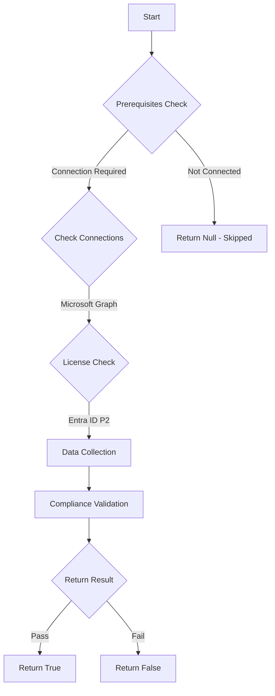

# Test-MtCisaActivationNotification: Checks for notification on role activation

## Overview

**Function Name:** `Test-MtCisaActivationNotification`
**Category:** CISA/Entra

## Description

User activation of the Global Administrator role SHALL trigger an alert.
    User activation of other highly privileged roles SHOULD trigger an alert.

## Workflow

## Phase Details

### Phase 1: Prerequisites Check

**Required Connections:**
- Microsoft Graph

**Required Licenses:**
- Entra ID P2

### Phase 2: Data Collection

**Cmdlets/Functions Used:**
- `Get-MtRole`
- `Invoke-MtGraphRequest`

### Phase 3: Compliance Validation

The function validates the collected data against compliance requirements.

### Phase 4: Return Result

| Return Value | Meaning |
| --- | --- |
| `$true` | Compliant |
| `$false` | Non-Compliant |
| `$null` | Skipped (missing prerequisites, license, or error) |

## Original Documentation

User activation of the Global Administrator role SHALL trigger an alert.

Rationale: Closely monitor activation of the Global Administrator role for signs of compromise. Send activation alerts to enable the security monitoring team to detect compromise attempts.

User activation of other highly privileged roles SHOULD trigger an alert.

Rationale: Closely monitor activation of high-risk roles for signs of compromise. Send activation alerts to enable the security monitoring team to detect compromise attempts. In some environments, activating privileged roles can generate a significant number of alerts.

#### Remediation action:

1. In **Entra admin center** select **Identity governance** and **Privileged Identity Management**.
2. Under **Manage**, select **Microsoft Entra roles**.
3. Under **Manage**, select **[Roles](https://entra.microsoft.com/#view/Microsoft_Azure_PIMCommon/ResourceMenuBlade/~/roles/resourceId//resourceType/tenant/provider/aadroles)**.
4. Search and click the **Global Administrator** role.

    For each of the highly privileged roles (other than Global Administrator), follow the same steps but enter a security monitoring mailbox different from the one used to monitor Global Administrator activations.

5. Click **Settings** and then click **Edit**.
6. Click the **Notifications** tab.
7. Under **Send notifications when eligible members activate this role**, in the **Role activation alert** > **Additional recipients** textbox, enter the email address of the security monitoring mailbox configured to receive role activation alerts.
8. Click **Update**.
9. If the role has any PIM groups actively assigned to it, then also apply the same configurations per the steps above to each PIM group's **Member** settings.

#### Related links

* [Entra admin center - Privileged Identity Management | Microsoft Entra roles](https://entra.microsoft.com/#view/Microsoft_Azure_PIMCommon/ResourceMenuBlade/~/roles/resourceId//resourceType/tenant/provider/aadroles)
* [CISA 7.8 Highly Privileged User Access - MS.AAD.7.8v1](https://github.com/cisagov/ScubaGear/blob/main/PowerShell/ScubaGear/baselines/aad.md#msaad78v1)
* [CISA ScubaGear Rego Reference](https://github.com/cisagov/ScubaGear/blob/main/PowerShell/ScubaGear/Rego/AADConfig.rego#L1022)
* [CISA 7.9 Highly Privileged User Access - MS.AAD.7.9v1](https://github.com/cisagov/ScubaGear/blob/main/PowerShell/ScubaGear/baselines/aad.md#msaad78v1)
* [CISA ScubaGear Rego Reference](https://github.com/cisagov/ScubaGear/blob/main/PowerShell/ScubaGear/Rego/AADConfig.rego#L1057)

<!--- Results --->
%TestResult%

## Standalone Function

See the standalone compliance check function: [`Test-MtCisaActivationNotificationCompliance.ps1`](../../standalone-functions/CISA/Entra/Test-MtCisaActivationNotificationCompliance.ps1)
