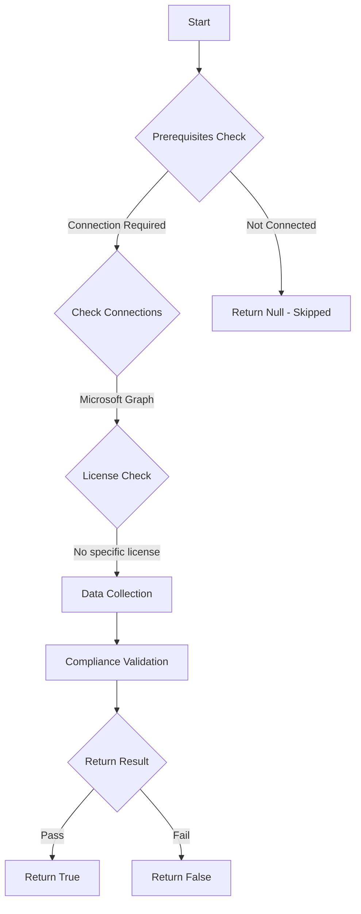

# MS.AAD: Checks if admin consent workflow is configured with reviewers

## Overview

**Function Name:** `Test-MtCisaAppAdminConsent`
**Category:** CISA/Entra
**Test Tag:** `MS.AAD`

## Description

An admin consent workflow SHALL be configured for applications.

## Workflow

## Phase Details

### Phase 1: Prerequisites Check

**Required Connections:**
- Microsoft Graph

### Phase 2: Data Collection

**Graph API Calls:**
- `policies/adminConsentRequestPolicy`

**Cmdlets/Functions Used:**
- `Invoke-MtGraphRequest`

### Phase 3: Compliance Validation

The function validates the collected data against compliance requirements.

### Phase 4: Return Result

| Return Value | Meaning |
| --- | --- |
| `$true` | Compliant |
| `$false` | Non-Compliant |
| `$null` | Skipped (missing prerequisites, license, or error) |

## Original Documentation

An admin consent workflow SHALL be configured for applications.

Rationale: Configuring an admin consent workflow reduces the risk of the previous policy by setting up a process for users to securely request access to applications necessary for business purposes. Administrators have the opportunity to review the permissions requested by new applications and approve or deny access based on a risk assessment.

#### Remediation action:

1. In **Entra** create a new **Group** that contains admin users responsible for reviewing and adjudicating application consent requests. Group members will be notified when users request consent for new applications.
2. Then in **Entra** under **Identity** and **Applications**, select **Enterprise applications**.
3. Under **Security**, select **Consent and permissions**.
3. Under **Manage**, select **[Admin consent settings](https://entra.microsoft.com/#view/Microsoft_AAD_IAM/ConsentPoliciesMenuBlade/~/AdminConsentSettings)**.
5. Under **Admin consent requests** and **Users can request admin consent to apps they are unable to consent to** select **Yes**.
6. Under **Who can review admin consent requests**, select **+ Add groups** and select the **group** responsible for reviewing and adjudicating app requests **(created in step one above)**.
7. Click **Save**.

#### Related links

* [Entra admin center - Consent and permissions | Admin consent settings](https://entra.microsoft.com/#view/Microsoft_AAD_IAM/ConsentPoliciesMenuBlade/~/AdminConsentSettings)
* [CISA Application Registration & Consent - MS.AAD.5.3v1](https://github.com/cisagov/ScubaGear/blob/main/PowerShell/ScubaGear/baselines/aad.md#msaad53v1)
* [CISA ScubaGear Rego Reference](https://github.com/cisagov/ScubaGear/blob/main/PowerShell/ScubaGear/Rego/AADConfig.rego#L613)

<!--- Results --->
%TestResult%

## Standalone Function

See the standalone compliance check function: [`Test-MtCisaAppAdminConsentCompliance.ps1`](../../standalone-functions/CISA/Entra/Test-MtCisaAppAdminConsentCompliance.ps1)
