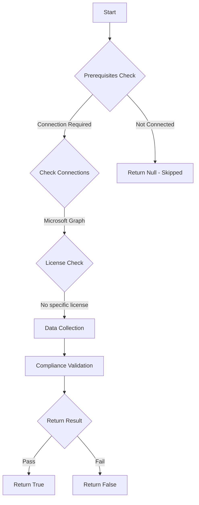

# MS.AAD: Checks if user app registration is prevented

## Overview

**Function Name:** `Test-MtCisaAppRegistration`
**Category:** CISA/Entra
**Test Tag:** `MS.AAD`

## Description

Only administrators SHALL be allowed to register applications.

## Workflow

## Phase Details

### Phase 1: Prerequisites Check

**Required Connections:**
- Microsoft Graph

### Phase 2: Data Collection

**Graph API Calls:**
- `policies/authorizationPolicy`

**Cmdlets/Functions Used:**
- `Invoke-MtGraphRequest`

### Phase 3: Compliance Validation

The function validates the collected data against compliance requirements.

### Phase 4: Return Result

| Return Value | Meaning |
| --- | --- |
| `$true` | Compliant |
| `$false` | Non-Compliant |
| `$null` | Skipped (missing prerequisites, license, or error) |

## Original Documentation

Only administrators SHALL be allowed to register applications.

Rationale: Application access for the tenant presents a heightened security risk compared to interactive user access because applications are typically not subject to critical security protections, such as MFA policies. Reduce risk of unauthorized users installing malicious applications into the tenant by ensuring that only specific privileged users can register applications.

#### Remediation action:

1. In **Entra**, under **Identity** and **Users**, select **[User settings](https://entra.microsoft.com/#view/Microsoft_AAD_UsersAndTenants/UserManagementMenuBlade/~/UserSettings/menuId/UserSettings)**.
2. For **Users can register applications**, select **No**.
3. Click **Save**.

#### Related links

* [Entra admin center - User settings](https://entra.microsoft.com/#view/Microsoft_AAD_UsersAndTenants/UserManagementMenuBlade/~/UserSettings/menuId/UserSettings)
* [CISA Application Registration & Consent - MS.AAD.5.1v1](https://github.com/cisagov/ScubaGear/blob/main/PowerShell/ScubaGear/baselines/aad.md#msaad51v1)
* [CISA ScubaGear Rego Reference](https://github.com/cisagov/ScubaGear/blob/main/PowerShell/ScubaGear/Rego/AADConfig.rego#L542)

<!--- Results --->
%TestResult%

## Standalone Function

See the standalone compliance check function: [`Test-MtCisaAppRegistrationCompliance.ps1`](../../standalone-functions/CISA/Entra/Test-MtCisaAppRegistrationCompliance.ps1)
