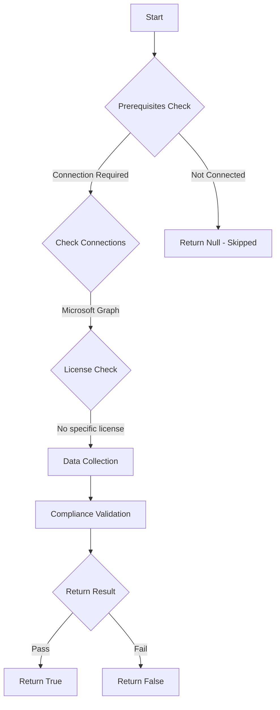

# MS.AAD: Checks if user app consent is prevented

## Overview

**Function Name:** `Test-MtCisaAppUserConsent`
**Category:** CISA/Entra
**Test Tag:** `MS.AAD`

## Description

Only administrators SHALL be allowed to consent to applications.

## Workflow

## Phase Details

### Phase 1: Prerequisites Check

**Required Connections:**
- Microsoft Graph

### Phase 2: Data Collection

**Graph API Calls:**
- `policies/authorizationPolicy`

**Cmdlets/Functions Used:**
- `Invoke-MtGraphRequest`

### Phase 3: Compliance Validation

The function validates the collected data against compliance requirements.

### Phase 4: Return Result

| Return Value | Meaning |
| --- | --- |
| `$true` | Compliant |
| `$false` | Non-Compliant |
| `$null` | Skipped (missing prerequisites, license, or error) |

## Original Documentation

Only administrators SHALL be allowed to consent to applications.

Rationale: Limiting applications consent to only specific privileged users reduces risk of users giving insecure applications access to their data via [consent grant attacks](https://learn.microsoft.com/en-us/microsoft-365/security/office-365-security/detect-and-remediate-illicit-consent-grants?view=o365-worldwide).

#### Remediation action:

1. In **Entra** under **Identity** and **Applications**, select **Enterprise applications**.
2. Under **Security**, select **Consent and permissions**.
3. Under **Manage**, select **[User consent settings](https://entra.microsoft.com/#view/Microsoft_AAD_IAM/ConsentPoliciesMenuBlade/~/UserSettings)**.
4. Under **User consent for applications**, select **Do not allow user consent**.
5. Click **Save**.

#### Related links

* [Entra admin center - Consent and permissions | User consent settings](https://entra.microsoft.com/#view/Microsoft_AAD_IAM/ConsentPoliciesMenuBlade/~/UserSettings)
* [CISA Application Registration & Consent - MS.AAD.5.2v1](https://github.com/cisagov/ScubaGear/blob/main/PowerShell/ScubaGear/baselines/aad.md#msaad52v1)
* [CISA ScubaGear Rego Reference](https://github.com/cisagov/ScubaGear/blob/main/PowerShell/ScubaGear/Rego/AADConfig.rego#L575)

<!--- Results --->
%TestResult%

## Standalone Function

See the standalone compliance check function: [`Test-MtCisaAppUserConsentCompliance.ps1`](../../standalone-functions/CISA/Entra/Test-MtCisaAppUserConsentCompliance.ps1)
