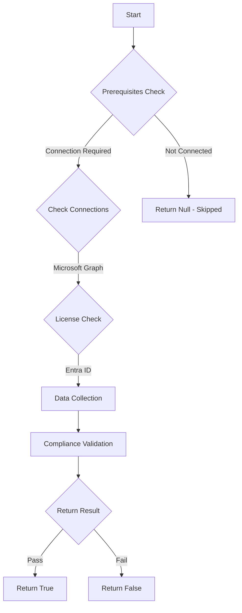

# MS.AAD: Checks if the Authentication Methods policy for Microsoft Authenticator is set appropriately

## Overview

**Function Name:** `Test-MtCisaAuthenticatorContext`
**Category:** CISA/Entra
**Test Tag:** `MS.AAD`

## Description

If Microsoft Authenticator is enabled, it SHALL be configured to show login context information.

## Workflow

## Phase Details

### Phase 1: Prerequisites Check

**Required Connections:**
- Microsoft Graph

**Required Licenses:**
- Entra ID

### Phase 2: Data Collection

**Cmdlets/Functions Used:**
- `Get-MtAuthenticationMethodPolicyConfig`

### Phase 3: Compliance Validation

**Properties Checked:**

| Property | Expected Value |
| --- | --- |
| `isSoftwareOathEnabled` | `$false` |

### Phase 4: Return Result

| Return Value | Meaning |
| --- | --- |
| `$true` | Compliant |
| `$false` | Non-Compliant |
| `$null` | Skipped (missing prerequisites, license, or error) |

## Original Documentation

If Microsoft Authenticator is enabled, it SHALL be configured to show login context information.

Rationale: This policy helps protect the tenant when Microsoft Authenticator is used by showing user context information, which helps reduce MFA phishing compromises.

#### Remediation action:

If Microsoft Authenticator is in use, configure Authenticator to display context information to users when they log in.

1. In Entra ID, click Security > [Authentication Methods](https://entra.microsoft.com/#view/Microsoft_AAD_IAM/AuthenticationMethodsMenuBlade/~/AdminAuthMethods/fromNav/Identity) > **Microsoft Authenticator**.
2. Click the **Configure tab**.
3. For **Allow use of Microsoft Authenticator OTP** select **No**.
4. Under Show application name in push and passwordless notifications select Status > **Enabled** and Target > Include > **All users**.
5. Under Show geographic location in push and passwordless notifications select Status > **Enabled** and Target > Include > **All users**.
6. Select **Save**.

#### Related links

* [CISA Strong Authentication & Secure Registration - MS.AAD.3.3v2](https://github.com/cisagov/ScubaGear/blob/main/PowerShell/ScubaGear/baselines/aad.md#msaad33v2)
* [CISA ScubaGear Rego Reference](https://github.com/cisagov/ScubaGear/blob/main/PowerShell/ScubaGear/Rego/AADConfig.rego#L254)

<!--- Results --->
%TestResult%

## Standalone Function

See the standalone compliance check function: [`Test-MtCisaAuthenticatorContextCompliance.ps1`](../../standalone-functions/CISA/Entra/Test-MtCisaAuthenticatorContextCompliance.ps1)
