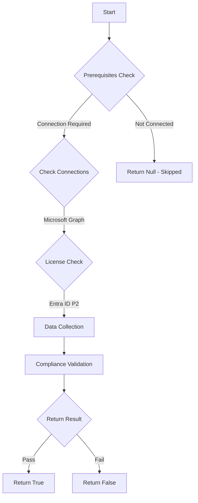

# MS.AAD: Checks if User Risk Based Policies - MS.AAD.2.1 is set to 'blocked'

## Overview

**Function Name:** `Test-MtCisaBlockHighRiskUser`
**Category:** CISA/Entra
**Test Tag:** `MS.AAD`

## Description

Users detected as high risk SHALL be blocked.

## Workflow

## Phase Details

### Phase 1: Prerequisites Check

**Required Connections:**
- Microsoft Graph

**Required Licenses:**
- Entra ID P2

### Phase 2: Data Collection

**Cmdlets/Functions Used:**
- `Get-MtConditionalAccessPolicy`

### Phase 3: Compliance Validation

The function validates the collected data against compliance requirements.

### Phase 4: Return Result

| Return Value | Meaning |
| --- | --- |
| `$true` | Compliant |
| `$false` | Non-Compliant |
| `$null` | Skipped (missing prerequisites, license, or error) |

## Original Documentation

Users detected as high risk SHALL be blocked.

Rationale: Blocking high-risk users may prevent compromised accounts from accessing the tenant. This prevents compromised accounts from accessing the tenant.

#### Remediation action:

Create a conditional access policy blocking users categorized as high risk by the Identity Protection service. Configure the following policy settings in the new conditional access policy as per the values below:

* Users > Include > **All users**
* Target resources > Cloud apps > **All cloud apps**
* Conditions > User risk > **High**
* Access controls > Grant > **Block Access**

Note: While CISA recommends blocking, the [Microsoft recommendation](https://learn.microsoft.com/entra/id-protection/howto-identity-protection-configure-risk-policies#microsofts-recommendation) is to require multi-factor authentication for high-risk users.

#### Related links

* [CISA Risk Based Policies - MS.AAD.2.1](https://github.com/cisagov/ScubaGear/blob/main/PowerShell/ScubaGear/baselines/aad.md#msaad21v1)
* [CISA ScubaGear Rego Reference](https://github.com/cisagov/ScubaGear/blob/main/PowerShell/ScubaGear/Rego/AADConfig.rego#L85)

<!--- Results --->
%TestResult%

## Standalone Function

See the standalone compliance check function: [`Test-MtCisaBlockHighRiskUserCompliance.ps1`](../../standalone-functions/CISA/Entra/Test-MtCisaBlockHighRiskUserCompliance.ps1)
