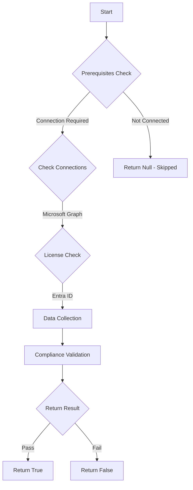

# MS.AAD: Checks if Baseline Policies Legacy Authentication - MS.AAD.1.1v1 is set to 'blocked'

## Overview

**Function Name:** `Test-MtCisaBlockLegacyAuth`
**Category:** CISA/Entra
**Test Tag:** `MS.AAD`

## Description

Legacy authentication SHALL be blocked.

## Workflow

## Phase Details

### Phase 1: Prerequisites Check

**Required Connections:**
- Microsoft Graph

**Required Licenses:**
- Entra ID

### Phase 2: Data Collection

**Cmdlets/Functions Used:**
- `Get-MtConditionalAccessPolicy`

### Phase 3: Compliance Validation

The function validates the collected data against compliance requirements.

### Phase 4: Return Result

| Return Value | Meaning |
| --- | --- |
| `$true` | Compliant |
| `$false` | Non-Compliant |
| `$null` | Skipped (missing prerequisites, license, or error) |

## Original Documentation

Legacy authentication SHALL be blocked.

Rationale: The security risk of allowing legacy authentication protocols is they do not support MFA. Blocking legacy protocols reduces the impact of user credential theft.

#### Remediation action:

Follow the guide below to create a conditional access policy that blocks legacy authentication.

- [Block legacy authentication - Microsoft Learn](https://learn.microsoft.com/entra/identity/conditional-access/howto-conditional-access-policy-block-legacy#create-a-conditional-access-policy)

#### Related links

- [CISA Legacy Authentication - MS.AAD.1.1v1](https://github.com/cisagov/ScubaGear/blob/main/PowerShell/ScubaGear/baselines/aad.md#1-legacy-authentication)
- [CISA ScubaGear Rego Reference](https://github.com/cisagov/ScubaGear/blob/main/PowerShell/ScubaGear/Rego/AADConfig.rego#L47)

<!--- Results --->
%TestResult%

## Standalone Function

See the standalone compliance check function: [`Test-MtCisaBlockLegacyAuthCompliance.ps1`](../../standalone-functions/CISA/Entra/Test-MtCisaBlockLegacyAuthCompliance.ps1)
