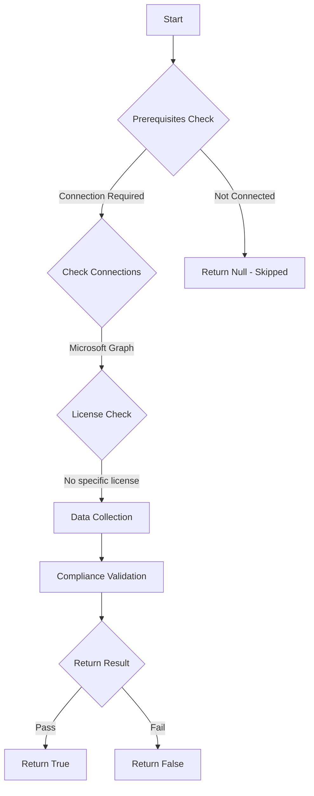

# MS.AAD: Checks if Global Admins are cloud users

## Overview

**Function Name:** `Test-MtCisaCloudGlobalAdmin`
**Category:** CISA/Entra
**Test Tag:** `MS.AAD`

## Description

Privileged users SHALL be provisioned cloud-only accounts separate from an on-premises directory or other federated identity providers.

## Workflow

## Phase Details

### Phase 1: Prerequisites Check

**Required Connections:**
- Microsoft Graph

### Phase 2: Data Collection

**Graph API Calls:**
- `users`

**Cmdlets/Functions Used:**
- `Get-MtRole`
- `Get-MtRoleMember`
- `Invoke-MtGraphRequest`

### Phase 3: Compliance Validation

**Properties Checked:**

| Property | Expected Value |
| --- | --- |
| `onPremisesSyncEnabled` | `$true` |

### Phase 4: Return Result

| Return Value | Meaning |
| --- | --- |
| `$true` | Compliant |
| `$false` | Non-Compliant |
| `$null` | Skipped (missing prerequisites, license, or error) |

## Original Documentation

Privileged users SHALL be provisioned cloud-only accounts separate from an on-premises directory or other federated identity providers.

Rationale: Many privileged administrative users do not need unfettered access to the tenant to perform their duties. By assigning them to roles based on least privilege, the risks associated with having their accounts compromised are reduced.

#### Remediation action:

1. Perform the steps below for each [highly privileged role](https://entra.microsoft.com/#view/Microsoft_AAD_IAM/RolesManagementMenuBlade/~/AllRoles).
2. Review the users listed that have an **OnPremisesImmutableId** and have **OnPremisesSyncEnabled** set.
3. Create a cloud only user account for that individual and remove their hybrid identity from privileged roles.

#### Related links

* [Entra admin center - Roles and administrators | All roles](https://entra.microsoft.com/#view/Microsoft_AAD_IAM/RolesManagementMenuBlade/~/AllRoles)
* [CISA 7.3 Highly Privileged User Access - MS.AAD.7.3v1](https://github.com/cisagov/ScubaGear/blob/main/PowerShell/ScubaGear/baselines/aad.md#msaad73v1)
* [CISA ScubaGear Rego Reference](https://github.com/cisagov/ScubaGear/blob/main/PowerShell/ScubaGear/Rego/AADConfig.rego#L833)

<!--- Results --->
%TestResult%

## Standalone Function

See the standalone compliance check function: [`Test-MtCisaCloudGlobalAdminCompliance.ps1`](../../standalone-functions/CISA/Entra/Test-MtCisaCloudGlobalAdminCompliance.ps1)
