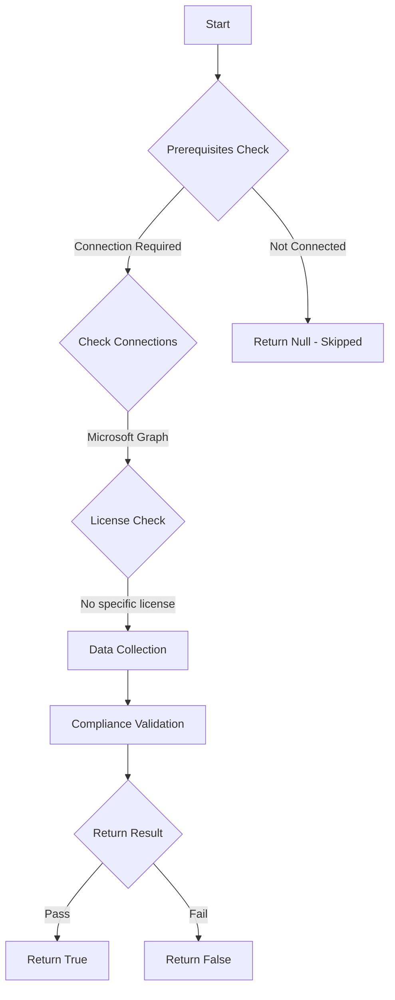

# MS.AAD: Checks cross-tenant default inbound access configuration

## Overview

**Function Name:** `Test-MtCisaCrossTenantInboundDefault`
**Category:** CISA/Entra
**Test Tag:** `MS.AAD`

## Description

Guest invites SHOULD only be allowed to specific external domains that have been authorized by the agency for legitimate business purposes.

## Workflow

## Phase Details

### Phase 1: Prerequisites Check

**Required Connections:**
- Microsoft Graph

### Phase 2: Data Collection

**Graph API Calls:**
- `policies/crossTenantAccessPolicy/default`

**Cmdlets/Functions Used:**
- `Invoke-MtGraphRequest`

### Phase 3: Compliance Validation

The function validates the collected data against compliance requirements.

### Phase 4: Return Result

| Return Value | Meaning |
| --- | --- |
| `$true` | Compliant |
| `$false` | Non-Compliant |
| `$null` | Skipped (missing prerequisites, license, or error) |

## Original Documentation

Guest invites SHOULD only be allowed to specific external domains that have been authorized by the agency for legitimate business purposes.

Rationale: Limiting which domains can be invited to create guest accounts in the tenant helps reduce the risk of users from unauthorized external organizations getting access.

> ⚠️ WARNING: This test utilizes a technical mechanism that differs from CISA's, though the outcome is the same.

#### Remediation action:

1. In **Entra admin center** select **External Identities** and **Cross-tenant access settings**.
2. Under **Default settings**, select [**Edit inbound defaults**](https://entra.microsoft.com/#view/Microsoft_AAD_IAM/InboundAccessSettings.ReactView/isDefault~/true/name//id/).
3. Under **B2B collaboration**, and **External users and groups**, ensure **Access status** is set to **Block access**.
4. Under **B2B collaboration**, and **Applications**, ensure **Access status** is set to **Block access**.

> This configuration will **only** allow B2B collaboration with other Entra tenants.

#### Related links

* [Entra admin center - External Identities | Cross-tenant access settings](https://entra.microsoft.com/#view/Microsoft_AAD_IAM/InboundAccessSettings.ReactView/isDefault~/true/name//id/)
* [CISA 8 Guest User Access - MS.AAD.8.3v1](https://github.com/cisagov/ScubaGear/blob/main/PowerShell/ScubaGear/baselines/aad.md#msaad83v1)
* [CISA ScubaGear Rego Reference](https://github.com/cisagov/ScubaGear/blob/main/PowerShell/ScubaGear/Rego/AADConfig.rego#L1190)

<!--- Results --->
%TestResult%

## Standalone Function

See the standalone compliance check function: [`Test-MtCisaCrossTenantInboundDefaultCompliance.ps1`](../../standalone-functions/CISA/Entra/Test-MtCisaCrossTenantInboundDefaultCompliance.ps1)
