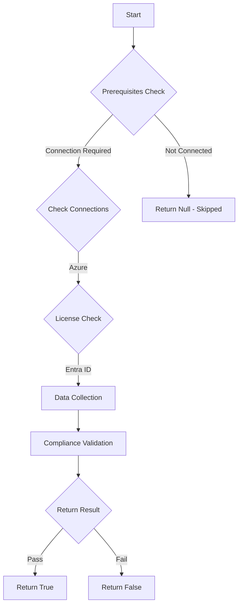

# MS.AAD: Checks for configuration of Entra diagnostic settings

## Overview

**Function Name:** `Test-MtCisaDiagnosticSettings`
**Category:** CISA/Entra
**Test Tag:** `MS.AAD`

## Description

Security logs SHALL be sent to the agency's security operations center for monitoring.

## Workflow

## Phase Details

### Phase 1: Prerequisites Check

**Required Connections:**
- Azure

**Required Licenses:**
- Entra ID

### Phase 2: Data Collection

**Cmdlets/Functions Used:**
- `Invoke-AzRestMethod`

### Phase 3: Compliance Validation

The function validates the collected data against compliance requirements.

### Phase 4: Return Result

| Return Value | Meaning |
| --- | --- |
| `$true` | Compliant |
| `$false` | Non-Compliant |
| `$null` | Skipped (missing prerequisites, license, or error) |

## Original Documentation

Security logs SHALL be sent to the agency's security operations center for monitoring.

Rationale: The security risk of not having visibility into cyber attacks is reduced by collecting logs in the agency’s centralized security detection infrastructure. This makes security events available for auditing, query, and incident response.

Note: The following logs (configured in Entra diagnostic settings), are required: `AuditLogs`, `SignInLogs`, `RiskyUsers`, `UserRiskEvents`, `NonInteractiveUserSignInLogs`, `ServicePrincipalSignInLogs`, `ADFSSignInLogs`, `RiskyServicePrincipals`, `ServicePrincipalRiskEvents`, `EnrichedOffice365AuditLogs`, `MicrosoftGraphActivityLogs`. If managed identities are used for Azure resources, also send the `ManagedIdentitySignInLogs` log type. If the Entra ID Provisioning Service is used to provision users to software-as-a-service (SaaS) apps or other systems, also send the `ProvisioningLogs` log type.

Note: Agencies can benefit from security detection capabilities offered by the CISA Cloud Log Aggregation Warehouse (CLAW) system. Agencies are urged to send the logs to CLAW. Contact CISA at cyberliason@cisa.dhs.gov to request integration instructions.

#### Remediation action:

Follow the configuration instructions unique to the products and integration patterns at your organization to send the security logs to the security operations center for monitoring.

#### Related links

* [CISA 4. Centralized Log Collection - MS.AAD.4.1v1](https://github.com/cisagov/ScubaGear/blob/main/PowerShell/ScubaGear/baselines/aad.md#msaad41v1)
* [CISA ScubaGear Rego Reference](https://github.com/cisagov/ScubaGear/blob/main/PowerShell/ScubaGear/Rego/AADConfig.rego#L523)

<!--- Results --->
%TestResult%

## Standalone Function

See the standalone compliance check function: [`Test-MtCisaDiagnosticSettingsCompliance.ps1`](../../standalone-functions/CISA/Entra/Test-MtCisaDiagnosticSettingsCompliance.ps1)
