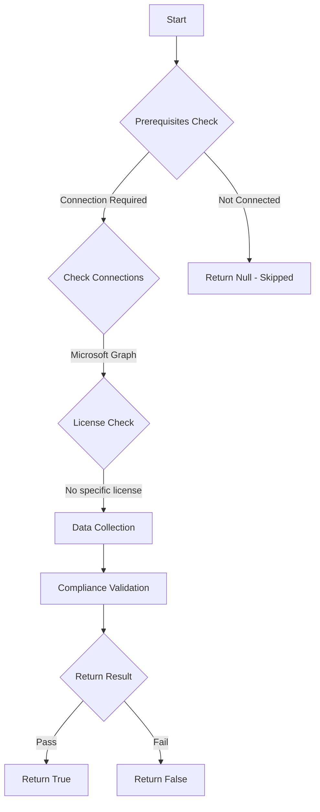

# MS.AAD: Checks if Global Admins is an acceptable number

## Overview

**Function Name:** `Test-MtCisaGlobalAdminCount`
**Category:** CISA/Entra
**Test Tag:** `MS.AAD`

## Description

A minimum of two users and a maximum of eight users SHALL be provisioned with the Global Administrator role.

## Workflow

## Phase Details

### Phase 1: Prerequisites Check

**Required Connections:**
- Microsoft Graph

### Phase 2: Data Collection

**Cmdlets/Functions Used:**
- `Get-MtRole`
- `Get-MtRoleMember`

### Phase 3: Compliance Validation

The function validates the collected data against compliance requirements.

### Phase 4: Return Result

| Return Value | Meaning |
| --- | --- |
| `$true` | Compliant |
| `$false` | Non-Compliant |
| `$null` | Skipped (missing prerequisites, license, or error) |

## Original Documentation

A minimum of two users and a maximum of eight users SHALL be provisioned with the Global Administrator role.

**Rationale:** The Global Administrator role provides unfettered access to the tenant (Azure and Microsoft 365). Limiting the number of users with this level of access makes tenant compromise more challenging. Microsoft recommends fewer than five users in the Global Administrator role. However, additional user accounts, up to eight, may be necessary to support emergency access and some operational scenarios.

#### Remediation action:

When counting the number of users assigned to the Global Administrator role, **count each user only once**.

1. In **Entra** under **Roles & adminis** and **[All roles](https://entra.microsoft.com/#view/Microsoft_AAD_IAM/RolesManagementMenuBlade/~/AllRoles)**, search for **Global Administrator** and click on it to go to the role and see who is assiged. Count users that are assigned directly to the role and users assigned via group membership.

    If you have **Entra ID PIM**, count both the **Eligible assignments** and **Active assignments**.

    If any of the groups assigned to Global Administrator are enrolled in **PIM for Groups**, also count the number of group members from the PIM for Groups portal **Eligible** assignments.

2. Validate that there are a total of two to eight users assigned to the Global Administrator role.

#### Related links

* [Entra admin center - Roles and administrators | All roles](https://entra.microsoft.com/#view/Microsoft_AAD_IAM/RolesManagementMenuBlade/~/AllRoles)
* [CISA 7.1 Highly Privileged User Access - MS.AAD.7.1v1](https://github.com/cisagov/ScubaGear/blob/main/PowerShell/ScubaGear/baselines/aad.md#msaad71v1)
* [CISA ScubaGear Rego Reference](https://github.com/cisagov/ScubaGear/blob/main/PowerShell/ScubaGear/Rego/AADConfig.rego#L761)

<!--- Results --->
%TestResult%

## Standalone Function

See the standalone compliance check function: [`Test-MtCisaGlobalAdminCountCompliance.ps1`](../../standalone-functions/CISA/Entra/Test-MtCisaGlobalAdminCountCompliance.ps1)
