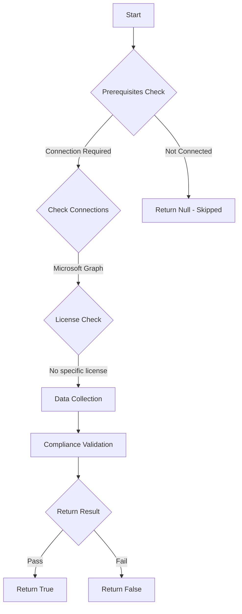

# MS.AAD: Checks the ratio of global admins to privileged roles

## Overview

**Function Name:** `Test-MtCisaGlobalAdminRatio`
**Category:** CISA/Entra
**Test Tag:** `MS.AAD`

## Description

Privileged users SHALL be provisioned with finer-grained roles instead of Global Administrator.

## Workflow

## Phase Details

### Phase 1: Prerequisites Check

**Required Connections:**
- Microsoft Graph

### Phase 2: Data Collection

**Cmdlets/Functions Used:**
- `Get-MtRole`
- `Get-MtRoleMember`

### Phase 3: Compliance Validation

**Properties Checked:**

| Property | Expected Value |
| --- | --- |
| `role` | `62e90394-69f5-4237-9190-012177145e10` |

### Phase 4: Return Result

| Return Value | Meaning |
| --- | --- |
| `$true` | Compliant |
| `$false` | Non-Compliant |
| `$null` | Skipped (missing prerequisites, license, or error) |

## Original Documentation

Privileged users SHALL be provisioned with finer-grained roles instead of Global Administrator.

Rationale: Many privileged administrative users do not need unfettered access to the tenant to perform their duties. By assigning them to roles based on least privilege, the risks associated with having their accounts compromised are reduced.

#### Remediation action:

This policy is based on the ratio below:

`X = (Number of users assigned to the Global Administrator role) / (Number of users assigned to other highly privileged roles)`

1. Follow the instructions for policy MS.AAD.7.1v1 above to get a count of users assigned to the Global Administrator role.
2. Follow the instructions for policy MS.AAD.7.1v1 above but get a count of users assigned to the other highly privileged roles (not Global Administrator). If a user is assigned to both Global Administrator and other roles, only count that user for the Global Administrator assignment.
3. Divide the value from step 2 from the value from step 1 to calculate X. If X is less than or equal to 1 then the tenant is compliant with the policy.

#### Related links

* [CISA 7.2 Highly Privileged User Access - MS.AAD.7.2v1](https://github.com/cisagov/ScubaGear/blob/main/PowerShell/ScubaGear/baselines/aad.md#msaad72v1)
* [CISA ScubaGear Rego Reference](https://github.com/cisagov/ScubaGear/blob/main/PowerShell/ScubaGear/Rego/AADConfig.rego#L792)

<!--- Results --->
%TestResult%

## Standalone Function

See the standalone compliance check function: [`Test-MtCisaGlobalAdminRatioCompliance.ps1`](../../standalone-functions/CISA/Entra/Test-MtCisaGlobalAdminRatioCompliance.ps1)
