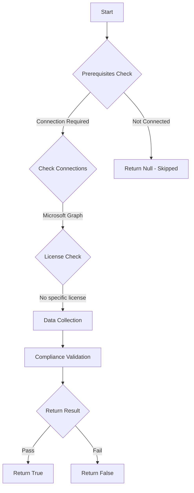

# MS.AAD: Checks if guest invitations are restricted to admins

## Overview

**Function Name:** `Test-MtCisaGuestInvitation`
**Category:** CISA/Entra
**Test Tag:** `MS.AAD`

## Description

Only users with the Guest Inviter role SHOULD be able to invite guest users.

## Workflow

## Phase Details

### Phase 1: Prerequisites Check

**Required Connections:**
- Microsoft Graph

### Phase 2: Data Collection

**Graph API Calls:**
- `policies/authorizationPolicy`

**Cmdlets/Functions Used:**
- `Invoke-MtGraphRequest`

### Phase 3: Compliance Validation

The function validates the collected data against compliance requirements.

### Phase 4: Return Result

| Return Value | Meaning |
| --- | --- |
| `$true` | Compliant |
| `$false` | Non-Compliant |
| `$null` | Skipped (missing prerequisites, license, or error) |

## Original Documentation

Only users with the Guest Inviter role SHOULD be able to invite guest users.

Rationale: By only allowing an authorized group of individuals to invite external users to create accounts in the tenant, an agency can enforce a guest user account approval process, reducing the risk of unauthorized account creation.

#### Remediation action:

1. In **Entra ID** and **External Identities**, select **[External collaboration settings](https://entra.microsoft.com/#view/Microsoft_AAD_IAM/CompanyRelationshipsMenuBlade/~/Settings/menuId/Settings)**.
2. Under **Guest invite settings**, select **Only users assigned to specific admin roles can invite guest users** or **No one in the organization can invite guest users including admins (most restrictive)**.

3. Click **Save**.

#### Related links

* [Entra admin center - External Identities | External collaboration settings](https://entra.microsoft.com/#view/Microsoft_AAD_IAM/CompanyRelationshipsMenuBlade/~/Settings/menuId/Settings)
* [CISA Guest User Access - MS.AAD.8.2v1](https://github.com/cisagov/ScubaGear/blob/main/PowerShell/ScubaGear/baselines/aad.md#msaad82v1)
* [CISA ScubaGear Rego Reference](https://github.com/cisagov/ScubaGear/blob/main/PowerShell/ScubaGear/Rego/AADConfig.rego#L1157)

<!--- Results --->
%TestResult%

## Standalone Function

See the standalone compliance check function: [`Test-MtCisaGuestInvitationCompliance.ps1`](../../standalone-functions/CISA/Entra/Test-MtCisaGuestInvitationCompliance.ps1)
