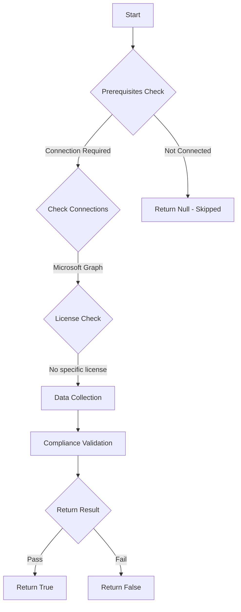

# MS.AAD: Checks if guests use proper role template

## Overview

**Function Name:** `Test-MtCisaGuestUserAccess`
**Category:** CISA/Entra
**Test Tag:** `MS.AAD`

## Description

Guest users SHOULD have limited or restricted access to Azure AD directory objects.

## Workflow

## Phase Details

### Phase 1: Prerequisites Check

**Required Connections:**
- Microsoft Graph

### Phase 2: Data Collection

**Graph API Calls:**
- `policies/authorizationPolicy`

**Cmdlets/Functions Used:**
- `Invoke-MtGraphRequest`

### Phase 3: Compliance Validation

**Properties Checked:**

| Property | Expected Value |
| --- | --- |
| `Id` | `$result.guestUserRoleId` |

### Phase 4: Return Result

| Return Value | Meaning |
| --- | --- |
| `$true` | Compliant |
| `$false` | Non-Compliant |
| `$null` | Skipped (missing prerequisites, license, or error) |

## Original Documentation

Guest users SHOULD have limited or restricted access to Azure AD directory objects.

Rationale: Limiting the amount of object information available to guest users in the tenant, reduces malicious reconnaissance exposure, should a guest account become compromised or be created by an adversary.

#### Remediation action

1. In **Entra ID** and **External Identities**, select **[External collaboration settings](https://entra.microsoft.com/#view/Microsoft_AAD_IAM/CompanyRelationshipsMenuBlade/~/Settings/menuId/Settings)**.
2. Under **Guest user access**, select either **Guest users have limited access to properties and memberships of directory objects** or **Guest user access is restricted to properties and memberships of their own directory objects (most restrictive)**.
3. Click **Save**.

#### Related links

* [Entra admin center - External Identities | External collaboration settings](https://entra.microsoft.com/#view/Microsoft_AAD_IAM/CompanyRelationshipsMenuBlade/~/Settings/menuId/Settings)
* [CISA Guest User Access - MS.AAD.8.1v1](https://github.com/cisagov/ScubaGear/blob/main/PowerShell/ScubaGear/baselines/aad.md#msaad81v1)
* [CISA ScubaGear Rego Reference](https://github.com/cisagov/ScubaGear/blob/main/PowerShell/ScubaGear/Rego/AADConfig.rego#L1100)

<!--- Results --->
%TestResult%

## Standalone Function

See the standalone compliance check function: [`Test-MtCisaGuestUserAccessCompliance.ps1`](../../standalone-functions/CISA/Entra/Test-MtCisaGuestUserAccessCompliance.ps1)
