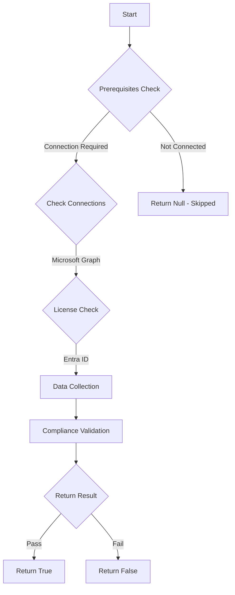

# MS.AAD: Checks if a policy is enabled requiring a managed device for registration

## Overview

**Function Name:** `Test-MtCisaManagedDeviceRegistration`
**Category:** CISA/Entra
**Test Tag:** `MS.AAD`

## Description

Managed Devices SHOULD be required to register MFA.

## Workflow

## Phase Details

### Phase 1: Prerequisites Check

**Required Connections:**
- Microsoft Graph

**Required Licenses:**
- Entra ID

### Phase 2: Data Collection

**Cmdlets/Functions Used:**
- `Get-MtConditionalAccessPolicy`

### Phase 3: Compliance Validation

The function validates the collected data against compliance requirements.

### Phase 4: Return Result

| Return Value | Meaning |
| --- | --- |
| `$true` | Compliant |
| `$false` | Non-Compliant |
| `$null` | Skipped (missing prerequisites, license, or error) |

## Original Documentation

Managed Devices SHOULD be required to register MFA.

Rationale: Reduce risk of an adversary using stolen user credentials and then registering their own MFA device to access the tenant by requiring a managed device provisioned and controlled by the agency to perform registration actions. This prevents the adversary from using their own unmanaged device to perform the registration.

#### Remediation action:

Create a conditional access policy requiring a user to be on a managed device when registering for MFA.

1. In **Entra** under **Protection** and **Conditional Access**, select **[Policies](https://entra.microsoft.com/#view/Microsoft_AAD_ConditionalAccess/ConditionalAccessBlade/~/Policies/fromNav/)**.
2. Click on **New policy**
3. Under **New Conditional Access policy**, configure the following policy settings in the new conditional access policy, per the values below:
    * Users > Include > **All users**
    * Target resources > User actions > **Register security information**
    * Access controls > Grant > Grant Access > **Require device to be marked as compliant** and **Require Microsoft Entra hybrid joined device** > For multiple controls > **Require one of the selected controls**
4. Click **Save**.

#### Related links

* [Entra admin center - Conditional Access | Policies](https://entra.microsoft.com/#view/Microsoft_AAD_ConditionalAccess/ConditionalAccessBlade/~/Policies/fromNav/)
* [CISA Strong Authentication & Secure Registration - MS.AAD.3.8v1](https://github.com/cisagov/ScubaGear/blob/main/PowerShell/ScubaGear/baselines/aad.md#msaad38v1)
* [CISA ScubaGear Rego Reference](https://github.com/cisagov/ScubaGear/blob/main/PowerShell/ScubaGear/Rego/AADConfig.rego#L431)

<!--- Results --->
%TestResult%

## Standalone Function

See the standalone compliance check function: [`Test-MtCisaManagedDeviceRegistrationCompliance.ps1`](../../standalone-functions/CISA/Entra/Test-MtCisaManagedDeviceRegistrationCompliance.ps1)
