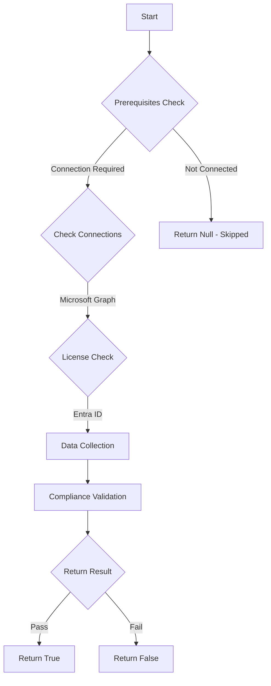

# MS.AAD: Checks if migration to Authentication Methods is complete

## Overview

**Function Name:** `Test-MtCisaMethodsMigration`
**Category:** CISA/Entra
**Test Tag:** `MS.AAD`

## Description

The Authentication Methods Manage Migration feature SHALL be set to Migration Complete.

## Workflow

## Phase Details

### Phase 1: Prerequisites Check

**Required Connections:**
- Microsoft Graph

**Required Licenses:**
- Entra ID

### Phase 2: Data Collection

**Graph API Calls:**
- `policies/authenticationmethodspolicy`

**Cmdlets/Functions Used:**
- `Invoke-MtGraphRequest`

### Phase 3: Compliance Validation

The function validates the collected data against compliance requirements.

### Phase 4: Return Result

| Return Value | Meaning |
| --- | --- |
| `$true` | Compliant |
| `$false` | Non-Compliant |
| `$null` | Skipped (missing prerequisites, license, or error) |

## Original Documentation

The Authentication Methods Manage Migration feature SHALL be set to Migration Complete.

Rationale: To disable the legacy authentication methods screen for the tenant, configure the Manage Migration feature to Migration Complete. The MFA and Self-Service Password Reset (SSPR) authentication methods are both managed from a central admin page, thereby reducing administrative complexity and potential security misconfigurations.

#### Remediation action:

If phishing-resistant MFA has not been enforced for all users yet, create a conditional access policy that enforces MFA but does not dictate MFA method. Configure the following policy settings in the new conditional access policy, per the values below:

1. Go through the process of [migrating from the legacy Azure AD MFA and Self-Service Password Reset (SSPR) administration pages to the new unified Authentication Methods policy page](https://learn.microsoft.com/en-us/entra/identity/authentication/how-to-authentication-methods-manage).
2. Once ready to finish the migration, [set the **Manage Migration** option to **Migration Complete**](https://learn.microsoft.com/en-us/entra/identity/authentication/how-to-authentication-methods-manage#finish-the-migration).

#### Related links

* [CISA Strong Authentication & Secure Registration - MS.AAD.3.4v1](https://github.com/cisagov/ScubaGear/blob/main/PowerShell/ScubaGear/baselines/aad.md#msaad34v1)
* [CISA ScubaGear Rego Reference](https://github.com/cisagov/ScubaGear/blob/main/PowerShell/ScubaGear/Rego/AADConfig.rego#L284)

<!--- Results --->
%TestResult%

## Standalone Function

See the standalone compliance check function: [`Test-MtCisaMethodsMigrationCompliance.ps1`](../../standalone-functions/CISA/Entra/Test-MtCisaMethodsMigrationCompliance.ps1)
