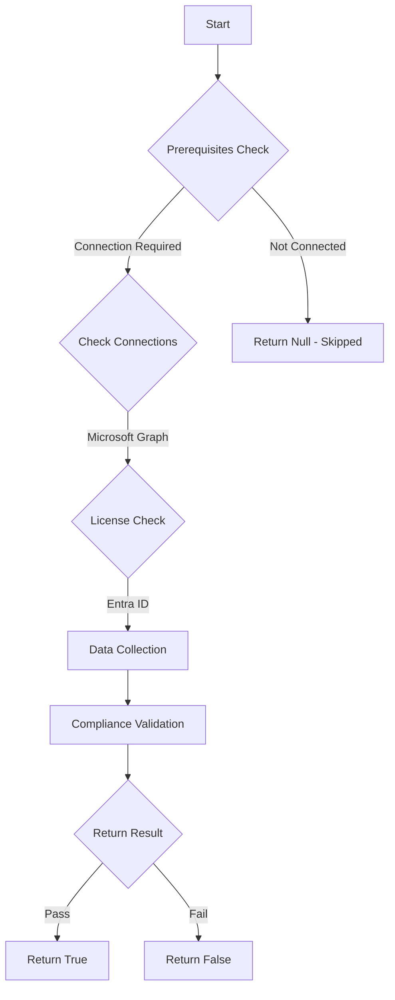

# MS.AAD: Checks if Conditional Access Policy requiring MFA is enabled

## Overview

**Function Name:** `Test-MtCisaMfa`
**Category:** CISA/Entra
**Test Tag:** `MS.AAD`

## Description

If phishing-resistant MFA has not been enforced, an alternative MFA method SHALL be enforced for all users

## Workflow

## Phase Details

### Phase 1: Prerequisites Check

**Required Connections:**
- Microsoft Graph

**Required Licenses:**
- Entra ID

### Phase 2: Data Collection

**Cmdlets/Functions Used:**
- `Get-MtConditionalAccessPolicy`

### Phase 3: Compliance Validation

The function validates the collected data against compliance requirements.

### Phase 4: Return Result

| Return Value | Meaning |
| --- | --- |
| `$true` | Compliant |
| `$false` | Non-Compliant |
| `$null` | Skipped (missing prerequisites, license, or error) |

## Original Documentation

If phishing-resistant MFA has not been enforced, an alternative MFA method SHALL be enforced for all users.

Rationale: This is a stopgap security policy to help protect the tenant if phishing-resistant MFA has not been enforced. This policy requires MFA enforcement, thus reducing single-form authentication risk.

#### Remediation action:

If phishing-resistant MFA has not been enforced for all users yet, create a conditional access policy that enforces MFA but does not dictate MFA method. Configure the following policy settings in the new conditional access policy, per the values below:

* Users > Include > **All users**
* Target resources > Cloud apps > **All cloud apps**
* Access controls > Grant > Grant Access > **Require multifactor authentication**

#### Related links

* [CISA Strong Authentication & Secure Registration - MS.AAD.3.2v1](https://github.com/cisagov/ScubaGear/blob/main/PowerShell/ScubaGear/baselines/aad.md#msaad32v1)
* [CISA ScubaGear Rego Reference](https://github.com/cisagov/ScubaGear/blob/main/PowerShell/ScubaGear/Rego/AADConfig.rego#L214)

<!--- Results --->
%TestResult%

## Standalone Function

See the standalone compliance check function: [`Test-MtCisaMfaCompliance.ps1`](../../standalone-functions/CISA/Entra/Test-MtCisaMfaCompliance.ps1)
