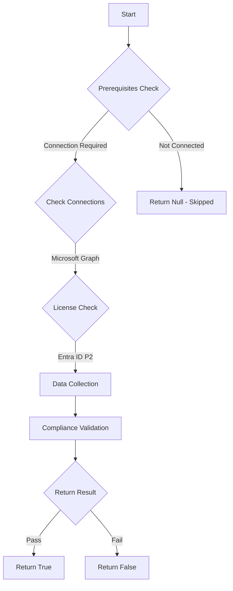

# Test-MtCisaNotifyHighRisk: Checks if Risk Based Policies - MS.AAD.2.2v1 has recipients

## Overview

**Function Name:** `Test-MtCisaNotifyHighRisk`
**Category:** CISA/Entra

## Description

A notification SHOULD be sent to the administrator when high-risk users are detected.

    Queries /identityProtection/settings/notifications
    and returns the result of
    (graph/identityProtection/settings/notifications)

## Workflow

## Phase Details

### Phase 1: Prerequisites Check

**Required Connections:**
- Microsoft Graph

**Required Licenses:**
- Entra ID P2

### Phase 2: Data Collection

**Graph API Calls:**
- `identityProtection/settings/notifications`

**Cmdlets/Functions Used:**
- `Invoke-MtGraphRequest`

### Phase 3: Compliance Validation

The function validates the collected data against compliance requirements.

### Phase 4: Return Result

| Return Value | Meaning |
| --- | --- |
| `$true` | Compliant |
| `$false` | Non-Compliant |
| `$null` | Skipped (missing prerequisites, license, or error) |

## Original Documentation

A notification SHOULD be sent to the administrator when high-risk users are detected.

Rationale: Notification enables the admin to monitor the event and remediate the risk. This helps the organization proactively respond to cyber intrusions as they occur.

#### Remediation action:

Follow the guide below to configure Entra ID Protection to send a regularly monitored security mailbox email notification when user accounts are determined to be high risk.

- [Configure Entra Identity Protection Notifications - Microsoft Learn](https://learn.microsoft.com/entra/id-protection/howto-identity-protection-configure-notifications#configure-users-at-risk-detected-alerts)

#### Related links

- [CISA Risk Based Policies - MS.AAD.2.2v1](https://github.com/cisagov/ScubaGear/blob/main/PowerShell/ScubaGear/baselines/aad.md#msaad22v1)
- [CISA ScubaGear Rego Reference](https://github.com/cisagov/ScubaGear/blob/main/PowerShell/ScubaGear/Rego/AADConfig.rego#L122)

<!--- Results --->
%TestResult%

## Standalone Function

See the standalone compliance check function: [`Test-MtCisaNotifyHighRiskCompliance.ps1`](../../standalone-functions/CISA/Entra/Test-MtCisaNotifyHighRiskCompliance.ps1)
