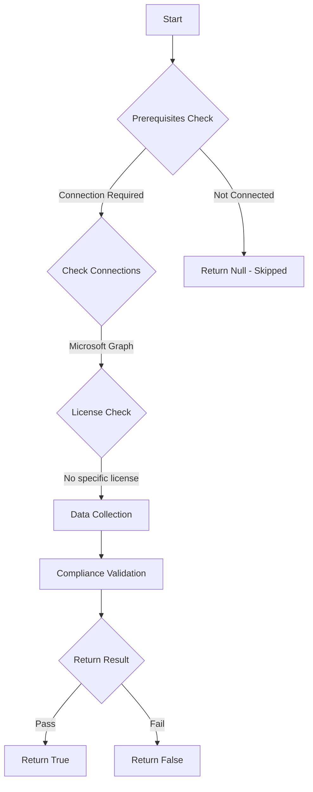

# MS.AAD: Checks if passwords are set to not expire

## Overview

**Function Name:** `Test-MtCisaPasswordExpiration`
**Category:** CISA/Entra
**Test Tag:** `MS.AAD`

## Description

User passwords SHALL NOT expire.

## Workflow

## Phase Details

### Phase 1: Prerequisites Check

**Required Connections:**
- Microsoft Graph

### Phase 2: Data Collection

**Graph API Calls:**
- `domains`

**Cmdlets/Functions Used:**
- `Invoke-MtGraphRequest`
- `Get-MgUser`

### Phase 3: Compliance Validation

The function validates the collected data against compliance requirements.

### Phase 4: Return Result

| Return Value | Meaning |
| --- | --- |
| `$true` | Compliant |
| `$false` | Non-Compliant |
| `$null` | Skipped (missing prerequisites, license, or error) |

## Original Documentation

User passwords SHALL NOT expire.

The National Institute of Standards and Technology (NIST), OMB, and Microsoft have published guidance indicating mandated periodic password changes make user accounts less secure. For example, OMB-22-09 states, "Password policies must not require use of special characters or regular rotation."

#### Remediation action:

Configure password policies to set passwords to never expire.
1. In **[Microsoft 365 admin center](https://admin.cloud.microsoft/)** under **Settings** and **Org settings**, select the tab **Security & privacy**.
2. Under **[Password expiration policy](https://admin.cloud.microsoft/?#/Settings/SecurityPrivacy/:/Settings/L1/PasswordPolicy)**, set **Set passwords to never expire**.
3. Click **Save**.

#### Related links

* [Microsoft 365 admin center - Org settings | Password expiration policy](https://admin.cloud.microsoft/?#/Settings/SecurityPrivacy/:/Settings/L1/PasswordPolicy)
* [Configure the **Password expiration policy** ](https://learn.microsoft.com/en-us/microsoft-365/admin/manage/set-password-expiration-policy?view=o365-worldwide#set-password-expiration-policy)
* [CISA Passwords - MS.AAD.6.1v1](https://github.com/cisagov/ScubaGear/blob/main/PowerShell/ScubaGear/baselines/aad.md#msaad61v1)
* [CISA ScubaGear Rego Reference](https://github.com/cisagov/ScubaGear/blob/main/PowerShell/ScubaGear/Rego/AADConfig.rego#L723)

<!--- Results --->
%TestResult%

## Standalone Function

See the standalone compliance check function: [`Test-MtCisaPasswordExpirationCompliance.ps1`](../../standalone-functions/CISA/Entra/Test-MtCisaPasswordExpirationCompliance.ps1)
