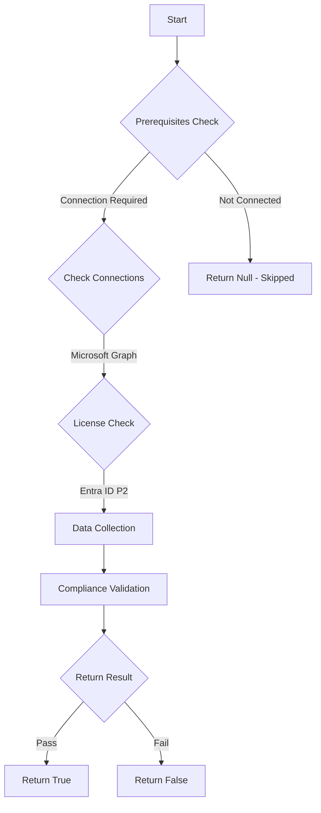

# MS.AAD: Checks for permanent active role assingments

## Overview

**Function Name:** `Test-MtCisaPermanentRoleAssignment`
**Category:** CISA/Entra
**Test Tag:** `MS.AAD`

## Description

Permanent active role assignments SHALL NOT be allowed for highly privileged roles.

## Workflow

## Phase Details

### Phase 1: Prerequisites Check

**Required Connections:**
- Microsoft Graph

**Required Licenses:**
- Entra ID P2

### Phase 2: Data Collection

**Cmdlets/Functions Used:**
- `Get-MtRole`
- `Invoke-MtGraphRequest`

### Phase 3: Compliance Validation

The function validates the collected data against compliance requirements.

### Phase 4: Return Result

| Return Value | Meaning |
| --- | --- |
| `$true` | Compliant |
| `$false` | Non-Compliant |
| `$null` | Skipped (missing prerequisites, license, or error) |

## Original Documentation

Permanent active role assignments SHALL NOT be allowed for highly privileged roles.

Rationale: Instead of giving users permanent assignments to privileged roles, provisioning access just in time lessens exposure if those accounts become compromised. In Azure AD PIM or an alternative PAM system, just in time access can be provisioned by assigning users to roles as eligible instead of perpetually active.

Note: Exceptions to this policy are:
* **Emergency access** accounts that need **perpetual access** to the tenant in the rare event of system degradation or other scenarios.
* Some types of **service accounts** that require a user account with privileged roles; since these accounts are used by software programs, they **cannot** perform role activation.

#### Remediation action:

1. In **Entra admin center** select **Show more** and **Roles & Admins** and then **[All roles](https://entra.microsoft.com/#view/Microsoft_AAD_IAM/RolesManagementMenuBlade/~/AllRoles)**.

    Perform the steps below for each highly privileged role. We reference the Global Administrator role as an example.

2. Select the **Global administrator** role.
3. Under **Manage**, select **Assignments** and click the **Active assignments** tab.
4. Verify there are no users or groups with a value of **Permanent** in the **End time** column. If there are any, recreate those assignments to have an expiration date using Entra ID PIM or an alternative PAM system. If a group is identified and it is enrolled in PIM for Groups, see the exception cases below for details.

#### Related links

* [Entra admin center - Roles and administrators | All roles](https://entra.microsoft.com/#view/Microsoft_AAD_IAM/RolesManagementMenuBlade/~/AllRoles)
* [CISA 7.4 Highly Privileged User Access - MS.AAD.7.4v1](https://github.com/cisagov/ScubaGear/blob/main/PowerShell/ScubaGear/baselines/aad.md#msaad74v1)
* [CISA ScubaGear Rego Reference](https://github.com/cisagov/ScubaGear/blob/main/PowerShell/ScubaGear/Rego/AADConfig.rego#L856)

<!--- Results --->
%TestResult%

## Standalone Function

See the standalone compliance check function: [`Test-MtCisaPermanentRoleAssignmentCompliance.ps1`](../../standalone-functions/CISA/Entra/Test-MtCisaPermanentRoleAssignmentCompliance.ps1)
