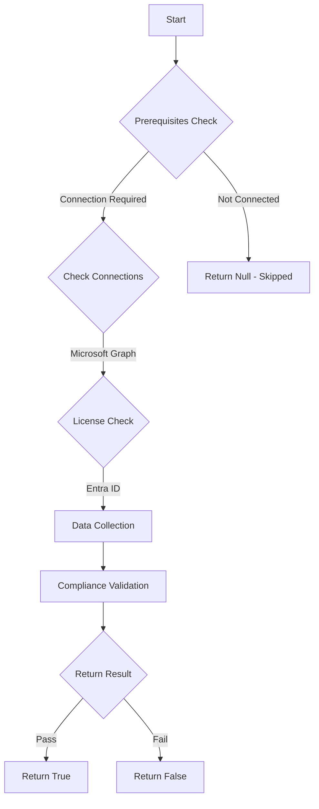

# MS.AAD: Checks if Conditional Access Policy requiring phishing resistant authentication methods for privileged roles is enabled

## Overview

**Function Name:** `Test-MtCisaPrivilegedPhishResistant`
**Category:** CISA/Entra
**Test Tag:** `MS.AAD`

## Description

Phishing-resistant MFA SHALL be required for highly privileged roles.

## Workflow

## Phase Details

### Phase 1: Prerequisites Check

**Required Connections:**
- Microsoft Graph

**Required Licenses:**
- Entra ID

### Phase 2: Data Collection

**Cmdlets/Functions Used:**
- `Get-MtRole`
- `Get-MtConditionalAccessPolicy`

### Phase 3: Compliance Validation

The function validates the collected data against compliance requirements.

### Phase 4: Return Result

| Return Value | Meaning |
| --- | --- |
| `$true` | Compliant |
| `$false` | Non-Compliant |
| `$null` | Skipped (missing prerequisites, license, or error) |

## Original Documentation

Phishing-resistant MFA SHALL be required for highly privileged roles.

Rationale: This is a backup security policy to help protect privileged access to the tenant if the conditional access policy, which requires MFA for all users, is disabled or misconfigured.

#### Remediation action:

Create a conditional access policy enforcing phishing-resistant MFA for highly privileged roles. Configure the following policy settings in the new conditional access policy, per the values below:

1. In **Entra** under **Protection** and **Conditional Access**, select **[Policies](https://entra.microsoft.com/#view/Microsoft_AAD_ConditionalAccess/ConditionalAccessBlade/~/Policies/fromNav/)**.
2. Click on **New policy**
3. Under **New Conditional Access policy**, configure the following policy settings in the new conditional access policy, per the values below:
    * Users > Include > Select users and groups > Directory roles > select each of the roles listed in the **[Highly Privileged Roles](https://github.com/cisagov/ScubaGear/blob/main/PowerShell/ScubaGear/baselines/aad.md#highly-privileged-roles)** listed.
    * Target resources > Cloud apps > **All cloud apps**
    * Access controls > Grant > Grant Access > Require authentication strength > **Phishing-resistant MFA**
4. Click **Save**.

#### Related links

* [Entra admin center - Conditional Access | Policies](https://entra.microsoft.com/#view/Microsoft_AAD_ConditionalAccess/ConditionalAccessBlade/~/Policies/fromNav/)
* [CISA Strong Authentication & Secure Registration - MS.AAD.3.6v1](https://github.com/cisagov/ScubaGear/blob/main/PowerShell/ScubaGear/baselines/aad.md#msaad36v1)
* [CISA ScubaGear Rego Reference](https://github.com/cisagov/ScubaGear/blob/main/PowerShell/ScubaGear/Rego/AADConfig.rego#L354)
* [CISA ScubaGear Highly Privileged Roles](https://github.com/cisagov/ScubaGear/blob/main/PowerShell/ScubaGear/baselines/aad.md#highly-privileged-roles)

<!--- Results --->
%TestResult%

## Standalone Function

See the standalone compliance check function: [`Test-MtCisaPrivilegedPhishResistantCompliance.ps1`](../../standalone-functions/CISA/Entra/Test-MtCisaPrivilegedPhishResistantCompliance.ps1)
