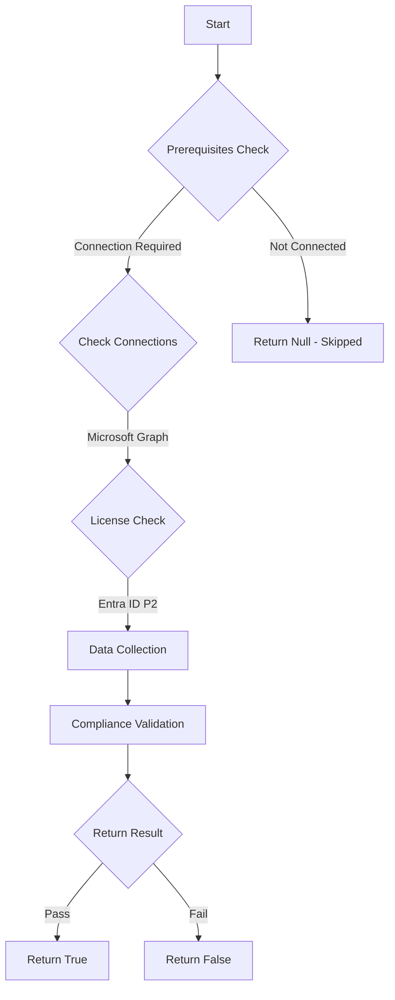

# MS.AAD: Checks for approval requirement on activation of Gloabl Admin role

## Overview

**Function Name:** `Test-MtCisaRequireActivationApproval`
**Category:** CISA/Entra
**Test Tag:** `MS.AAD`

## Description

Activation of the Global Administrator role SHALL require approval.

## Workflow

## Phase Details

### Phase 1: Prerequisites Check

**Required Connections:**
- Microsoft Graph

**Required Licenses:**
- Entra ID P2

### Phase 2: Data Collection

**Cmdlets/Functions Used:**
- `Get-MtRole`
- `Invoke-MtGraphRequest`

### Phase 3: Compliance Validation

The function validates the collected data against compliance requirements.

### Phase 4: Return Result

| Return Value | Meaning |
| --- | --- |
| `$true` | Compliant |
| `$false` | Non-Compliant |
| `$null` | Skipped (missing prerequisites, license, or error) |

## Original Documentation

Activation of the Global Administrator role SHALL require approval.

Rationale: Requiring approval for a user to activate Global Administrator, which provides unfettered access, makes it more challenging for an attacker to compromise the tenant with stolen credentials and it provides visibility of activities indicating a compromise is taking place.

#### Remediation action:

1. In **Entra admin center** select **Identity governance** and **Privileged Identity Management**.
2. Under **Manage**, select **Microsoft Entra roles**.
3. Under **Manage**, select **[Roles](https://entra.microsoft.com/#view/Microsoft_Azure_PIMCommon/ResourceMenuBlade/~/roles/resourceId//resourceType/tenant/provider/aadroles)**.
4. Select the **Global Administrator** role in the list.
5. Click **Settings**.
6. Click **Edit**.
7. Select the **Require approval to activate** option.
8. Click **Update**.
9. Review the list of groups that are actively assigned to the **Global Administrator** role. If any of the groups are enrolled in PIM for Groups, then also apply the same configurations under step 2 above to each PIM group's Member settings.

#### Related links

* [Entra admin center - Privileged Identity Management | Microsoft Entra roles](https://entra.microsoft.com/#view/Microsoft_Azure_PIMCommon/ResourceMenuBlade/~/roles/resourceId//resourceType/tenant/provider/aadroles)
* [CISA 7.6 Highly Privileged User Access - MS.AAD.7.6v1](https://github.com/cisagov/ScubaGear/blob/main/PowerShell/ScubaGear/baselines/aad.md#msaad76v1)
* [CISA ScubaGear Rego Reference](https://github.com/cisagov/ScubaGear/blob/main/PowerShell/ScubaGear/Rego/AADConfig.rego#L938)

<!--- Results --->
%TestResult%

## Standalone Function

See the standalone compliance check function: [`Test-MtCisaRequireActivationApprovalCompliance.ps1`](../../standalone-functions/CISA/Entra/Test-MtCisaRequireActivationApprovalCompliance.ps1)
