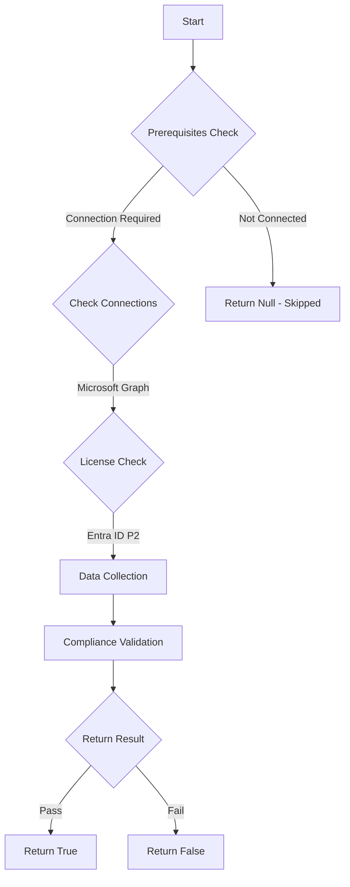

# MS.AAD: Checks for active role assingments with no start time

## Overview

**Function Name:** `Test-MtCisaUnmanagedRoleAssignment`
**Category:** CISA/Entra
**Test Tag:** `MS.AAD`

## Description

Provisioning users to highly privileged roles SHALL NOT occur outside of a PAM system.

## Workflow

## Phase Details

### Phase 1: Prerequisites Check

**Required Connections:**
- Microsoft Graph

**Required Licenses:**
- Entra ID P2

### Phase 2: Data Collection

**Cmdlets/Functions Used:**
- `Get-MtRole`
- `Invoke-MtGraphRequest`
- `Get-MtSafeMarkdown`

### Phase 3: Compliance Validation

The function validates the collected data against compliance requirements.

### Phase 4: Return Result

| Return Value | Meaning |
| --- | --- |
| `$true` | Compliant |
| `$false` | Non-Compliant |
| `$null` | Skipped (missing prerequisites, license, or error) |

## Original Documentation

Provisioning users to highly privileged roles SHALL NOT occur outside of a PAM system.

Rationale: Provisioning users to privileged roles within a PAM system enables enforcement of numerous privileged access policies and monitoring. If privileged users are assigned directly to roles in the M365 admin center or via PowerShell outside of the context of a PAM system, a significant set of critical security capabilities are bypassed.

#### Remediation action:

1. In **Entra admin center** select **Show more** > **Roles & admins** and then select **[All roles](https://entra.microsoft.com/#view/Microsoft_AAD_IAM/RolesManagementMenuBlade/~/AllRoles)**.

    Perform the steps below for each highly privileged role. We reference the **Global Administrator** role as an example.

2. Select the **Global administrator** role.
3. Under **Manage**, select **Assignments** and click the **Active assignments** tab.
4. For each user or group listed, examine the value in the Start time column. If it contains a value of -, this indicates the respective user/group was assigned to that role outside of Entra ID PIM. If the role was assigned outside of Entra ID PIM, delete the assignment and recreate it using Entra ID PIM.

#### Related links

* [Entra admin center - Roles and administrators | All roles](https://entra.microsoft.com/#view/Microsoft_Azure_PIMCommon/ResourceMenuBlade/~/roles/resourceId//resourceType/tenant/provider/aadroles)
* [CISA 7.5 Highly Privileged User Access - MS.AAD.7.5v1](https://github.com/cisagov/ScubaGear/blob/main/PowerShell/ScubaGear/baselines/aad.md#msaad75v1)
* [CISA ScubaGear Rego Reference](https://github.com/cisagov/ScubaGear/blob/main/PowerShell/ScubaGear/Rego/AADConfig.rego#L907)

<!--- Results --->
%TestResult%

## Standalone Function

See the standalone compliance check function: [`Test-MtCisaUnmanagedRoleAssignmentCompliance.ps1`](../../standalone-functions/CISA/Entra/Test-MtCisaUnmanagedRoleAssignmentCompliance.ps1)
