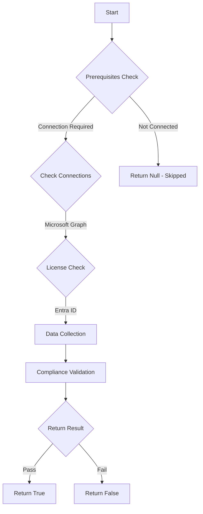

# MS.AAD: Checks if weak Authentication Methods are disabled

## Overview

**Function Name:** `Test-MtCisaWeakFactor`
**Category:** CISA/Entra
**Test Tag:** `MS.AAD`

## Description

The authentication methods SMS, Voice Call, and Email One-Time Passcode (OTP) SHALL be disabled.

## Workflow

## Phase Details

### Phase 1: Prerequisites Check

**Required Connections:**
- Microsoft Graph

**Required Licenses:**
- Entra ID

### Phase 2: Data Collection

**Cmdlets/Functions Used:**
- `Get-MtAuthenticationMethodPolicyConfig`

### Phase 3: Compliance Validation

The function validates the collected data against compliance requirements.

### Phase 4: Return Result

| Return Value | Meaning |
| --- | --- |
| `$true` | Compliant |
| `$false` | Non-Compliant |
| `$null` | Skipped (missing prerequisites, license, or error) |

## Original Documentation

The authentication methods SMS, Voice Call, and Email One-Time Passcode (OTP) SHALL be disabled.

Rationale: SMS, voice call, and email OTP are the weakest authenticators. This policy forces users to use stronger MFA methods.

#### Remediation action:

If phishing-resistant MFA has not been deployed yet and Microsoft Authenticator is in use, configure Authenticator to display context information to users when they log in.

1. In **Entra ID**, click **Security** > **[Authentication methods](https://entra.microsoft.com/#view/Microsoft_AAD_IAM/AuthenticationMethodsMenuBlade/~/AdminAuthMethods/fromNav/Identity)**
2. Click on the **SMS**, **Voice Call**, and **Email OTP** authentication methods and disable each of them. Their statuses should be **Enabled** > **No** on the **Authentication methods** > **Policies** page.

#### Related links

* [Entra admin portal - Authentication methods](https://entra.microsoft.com/#view/Microsoft_AAD_IAM/AuthenticationMethodsMenuBlade/~/AdminAuthMethods/fromNav/Identity)
* [CISA Strong Authentication & Secure Registration - MS.AAD.3.5v1](https://github.com/cisagov/ScubaGear/blob/main/PowerShell/ScubaGear/baselines/aad.md#msaad35v1)
* [CISA ScubaGear Rego Reference](https://github.com/cisagov/ScubaGear/blob/main/PowerShell/ScubaGear/Rego/AADConfig.rego#L307)

<!--- Results --->
%TestResult%

## Standalone Function

See the standalone compliance check function: [`Test-MtCisaWeakFactorCompliance.ps1`](../../standalone-functions/CISA/Entra/Test-MtCisaWeakFactorCompliance.ps1)
