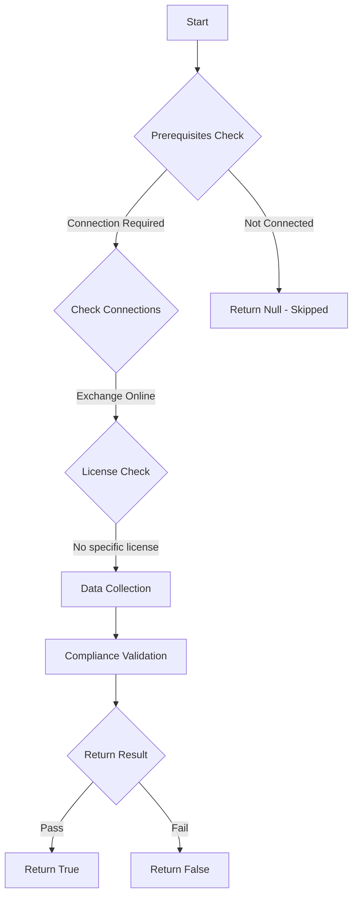

# MS.EXO: Checks state of anti-spam policies

## Overview

**Function Name:** `Test-MtCisaAntiSpamSafeList`
**Category:** CISA/Exchange
**Test Tag:** `MS.EXO`

## Description

Safe lists SHOULD NOT be enabled.

## Workflow

## Phase Details

### Phase 1: Prerequisites Check

**Required Connections:**
- Exchange Online

### Phase 2: Data Collection

**Exchange Online Requests:**
- `HostedConnectionFilterPolicy`

### Phase 3: Compliance Validation

The function validates the collected data against compliance requirements.

### Phase 4: Return Result

| Return Value | Meaning |
| --- | --- |
| `$true` | Compliant |
| `$false` | Non-Compliant |
| `$null` | Skipped (missing prerequisites, license, or error) |

## Original Documentation

Safe lists SHOULD NOT be enabled.

Rationale: Messages sent from allowed safe list addresses bypass important security mechanisms, including spam filtering and sender authentication checks. Avoiding use of safe lists prevents potential threats from circumventing security mechanisms. While blocking all malicious senders is not feasible, blocking specific known, malicious IP addresses may reduce the threat from specific senders.

#### Remediation action:

To modify the connection filters, follow the instructions found in Use the Microsoft 365 Defender portal to modify the default connection filter policy.
1. Sign in to **Microsoft 365 Defender portal**.
2. From the left-hand menu, find **Email & collaboration** and select **Policies and Rules**.
3. Select **Threat Policies** from the list of policy names.
4. Under **Policies**, select [**Anti-spam**](https://security.microsoft.com/antispam).
5. Select **Connection filter policy (Default)**.
6. Click **Edit connection filter policy**.
8. Ensure **Turn on safe list** is not selected.

#### Related links

* [Defender admin center - Anti-spam policies](https://security.microsoft.com/antispam)
* [CISA 12 IP Allow Lists - MS.EXO.12.2v1](https://github.com/cisagov/ScubaGear/blob/main/PowerShell/ScubaGear/baselines/exo.md#msexo122v1)
* [CISA ScubaGear Rego Reference](https://github.com/cisagov/ScubaGear/blob/main/PowerShell/ScubaGear/Rego/EXOConfig.rego#L710)

<!--- Results --->
%TestResult%

## Standalone Function

See the standalone compliance check function: [`Test-MtCisaAntiSpamSafeListCompliance.ps1`](../../standalone-functions/CISA/Exchange/Test-MtCisaAntiSpamSafeListCompliance.ps1)
