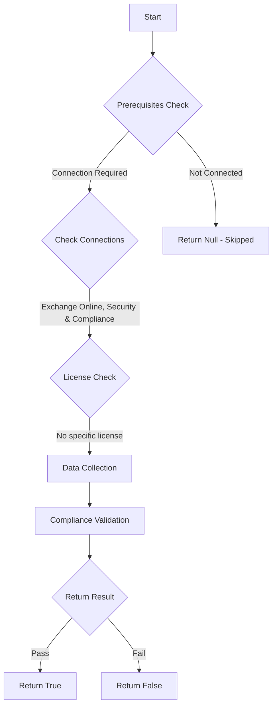

# MS.EXO: Checks state of purview

## Overview

**Function Name:** `Test-MtCisaAuditLog`
**Category:** CISA/Exchange
**Test Tag:** `MS.EXO`

## Description

Microsoft Purview Audit (Standard) logging SHALL be enabled.

## Workflow

## Phase Details

### Phase 1: Prerequisites Check

**Required Connections:**
- Exchange Online
- Security & Compliance

### Phase 2: Data Collection

**Cmdlets/Functions Used:**
- `Get-AdminAuditLogConfig`

### Phase 3: Compliance Validation

The function validates the collected data against compliance requirements.

### Phase 4: Return Result

| Return Value | Meaning |
| --- | --- |
| `$true` | Compliant |
| `$false` | Non-Compliant |
| `$null` | Skipped (missing prerequisites, license, or error) |

## Original Documentation

Microsoft Purview Audit (Standard) logging SHALL be enabled.

Rationale: Responding to incidents without detailed information about activities that took place slows response actions. Enabling Microsoft Purview Audit (Standard) helps ensure agencies have visibility into user actions. Furthermore, Microsoft Purview Audit (Standard) is required for government agencies by OMB M-21-31 (referred to therein by its former name, Unified Audit Logs).

#### Remediation action:

To enable auditing via the Microsoft Purview compliance portal:
1. Sign in to the **Microsoft Purview compliance portal**.
2. Under **Solutions**, select [**Audit**](https://purview.microsoft.com/audit/auditsearch).
3. If auditing is not enabled, a banner is displayed to notify the administrator to start recording user and admin activity.
4. Click the **Start recording user and admin activity**.

#### Related links

* [Purview portal - Audit search](https://purview.microsoft.com/audit/auditsearch)
* [CISA 17 Audit Logging - MS.EXO.17.1](https://github.com/cisagov/ScubaGear/blob/main/PowerShell/ScubaGear/baselines/exo.md#msexo171v1)
* [CISA ScubaGear Rego Reference](https://github.com/cisagov/ScubaGear/blob/main/PowerShell/ScubaGear/Rego/EXOConfig.rego#L898)

<!--- Results --->
%TestResult%

## Standalone Function

See the standalone compliance check function: [`Test-MtCisaAuditLogCompliance.ps1`](../../standalone-functions/CISA/Exchange/Test-MtCisaAuditLogCompliance.ps1)
