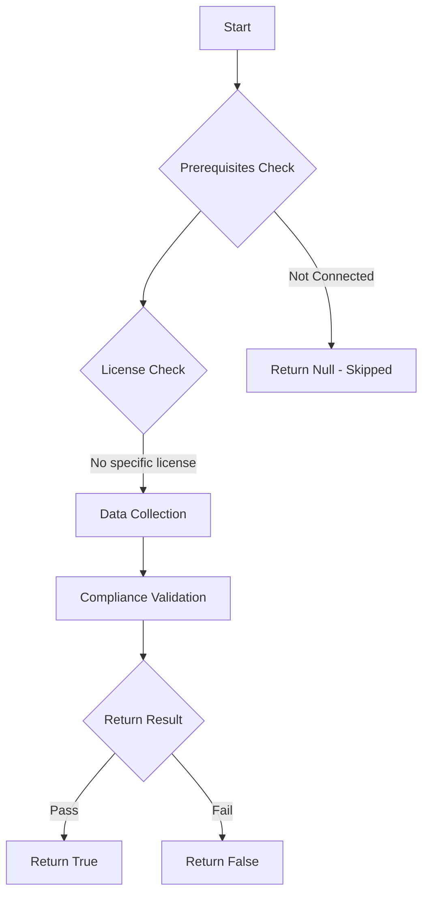

# MS.EXO: Checks state of purview

## Overview

**Function Name:** `Test-MtCisaAuditLogPremium`
**Category:** CISA/Exchange
**Test Tag:** `MS.EXO`

## Description

Microsoft Purview Audit (Premium) logging SHALL be enabled.

## Workflow

## Phase Details

### Phase 1: Prerequisites Check

No specific prerequisites required.

### Phase 2: Data Collection

### Phase 3: Compliance Validation

The function validates the collected data against compliance requirements.

### Phase 4: Return Result

| Return Value | Meaning |
| --- | --- |
| `$true` | Compliant |
| `$false` | Non-Compliant |
| `$null` | Skipped (missing prerequisites, license, or error) |

## Original Documentation

**This is no longer applicable, and is deprecated by CISA. The content below is retained as a historical archive and will be removed in a future version.**

Microsoft Purview Audit (Premium) logging SHALL be enabled.

Rationale: Standard logging may not include relevant details necessary for visibility into user actions during an incident. Enabling Microsoft Purview Audit (Premium) captures additional event types not included with Standard. Furthermore, it is required for government agencies by OMB M-21-13 (referred to therein by its former name, Unified Audit Logs w/Advanced Features).

#### Remediation action:

To set up Microsoft Purview Audit (Premium), see [Set up Microsoft Purview Audit (Premium) | Microsoft Learn](https://learn.microsoft.com/en-us/purview/audit-premium-setup?view=o365-worldwide).

#### Related links

* [Purview portal - Audit search](https://purview.microsoft.com/audit/auditsearch)
* [CISA 17 Audit Logging - MS.EXO.17.2](https://github.com/cisagov/ScubaGear/blob/main/PowerShell/ScubaGear/baselines/exo.md#msexo172v1)
* [CISA ScubaGear Rego Reference](https://github.com/cisagov/ScubaGear/blob/main/PowerShell/ScubaGear/Rego/EXOConfig.rego#L913)

<!--- Results --->
%TestResult%

## Standalone Function

See the standalone compliance check function: [`Test-MtCisaAuditLogPremiumCompliance.ps1`](../../standalone-functions/CISA/Exchange/Test-MtCisaAuditLogPremiumCompliance.ps1)
