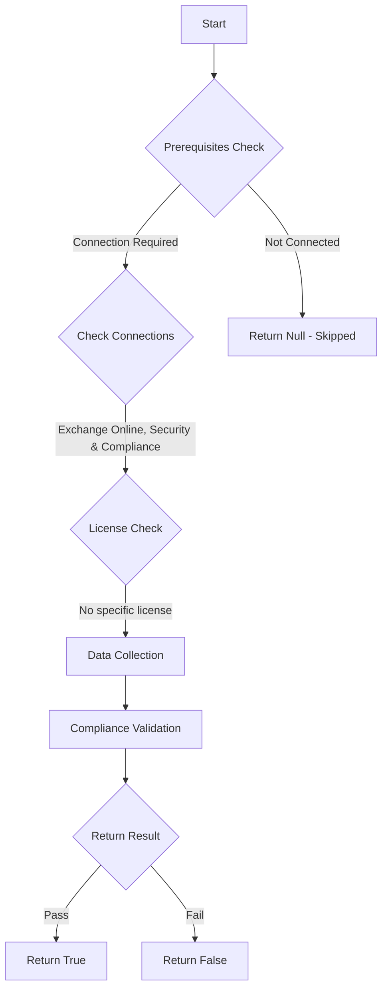

# MS.EXO: Checks state of purview

## Overview

**Function Name:** `Test-MtCisaAuditLogRetention`
**Category:** CISA/Exchange
**Test Tag:** `MS.EXO`

## Description

Audit logs SHALL be maintained for at least the minimum duration dictated by OMB M-21-31 (Appendix C).

## Workflow

## Phase Details

### Phase 1: Prerequisites Check

**Required Connections:**
- Exchange Online
- Security & Compliance

### Phase 2: Data Collection

**Cmdlets/Functions Used:**
- `Get-UnifiedAuditLogRetentionPolicy`

### Phase 3: Compliance Validation

**Properties Checked:**

| Property | Expected Value |
| --- | --- |
| `RecordTypes` | `ExchangeAdmin` |
| `RecordTypes` | `ExchangeItem` |
| `RecordTypes` | `ExchangeItemGroup` |
| `RecordTypes` | `ExchangeAggregatedOperation` |
| `RecordTypes` | `ExchangeItemAggregated` |
| `RetentionDuration` | `TwelveMonths` |

### Phase 4: Return Result

| Return Value | Meaning |
| --- | --- |
| `$true` | Compliant |
| `$false` | Non-Compliant |
| `$null` | Skipped (missing prerequisites, license, or error) |

## Original Documentation

Audit logs SHALL be maintained for at least the minimum duration dictated by OMB M-21-31 (Appendix C).

Rationale: Audit logs may no longer be available when needed if they are not retained for a sufficient time. Increased log retention time gives an agency the necessary visibility to investigate incidents that occurred some time ago. OMB M-21-13, Appendix C, Table 5 specifically calls out Unified Audit Logs in the Cloud Azure log category.

#### Remediation action:

To create one or more custom audit retention policies, if the default retention policy is not sufficient for agency needs, follow [Create an audit log retention policy](https://learn.microsoft.com/en-us/purview/audit-log-retention-policies?view=o365-worldwide&tabs=microsoft-purview-portal#create-an-audit-log-retention-policy) instructions. Ensure the duration selected in the retention policies is at least one year, in accordance with OMB M-21-31.

#### Related links

* [Purview portal - Audit policies](https://purview.microsoft.com/audit/auditpolicies)
* [CISA 17 Audit Logging - MS.EXO.17.3](https://github.com/cisagov/ScubaGear/blob/main/PowerShell/ScubaGear/baselines/exo.md#msexo173v1)
* [CISA ScubaGear Rego Reference](https://github.com/cisagov/ScubaGear/blob/main/PowerShell/ScubaGear/Rego/EXOConfig.rego#L928)

<!--- Results --->
%TestResult%

## Standalone Function

See the standalone compliance check function: [`Test-MtCisaAuditLogRetentionCompliance.ps1`](../../standalone-functions/CISA/Exchange/Test-MtCisaAuditLogRetentionCompliance.ps1)
