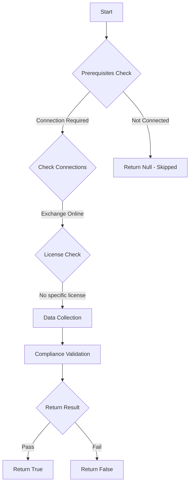

# MS.EXO: Checks ...

## Overview

**Function Name:** `Test-MtCisaAutoExternalForwarding`
**Category:** CISA/Exchange
**Test Tag:** `MS.EXO`

## Description

Automatic forwarding to external domains SHALL be disabled.

## Workflow

## Phase Details

### Phase 1: Prerequisites Check

**Required Connections:**
- Exchange Online

### Phase 2: Data Collection

**Exchange Online Requests:**
- `RemoteDomain`

### Phase 3: Compliance Validation

The function validates the collected data against compliance requirements.

### Phase 4: Return Result

| Return Value | Meaning |
| --- | --- |
| `$true` | Compliant |
| `$false` | Non-Compliant |
| `$null` | Skipped (missing prerequisites, license, or error) |

## Original Documentation

Automatic forwarding to external domains SHALL be disabled.

Rationale: Adversaries can use automatic forwarding to gain persistent access to a victim's email. Disabling forwarding to external domains prevents this technique when the adversary is external to the organization but does not impede legitimate internal forwarding.

#### Remediation action:

To disable automatic forwarding to external domains:

1. Sign in to the **Exchange admin center**.
2. Select **Mail flow**, then **[Remote domains](https://admin.exchange.microsoft.com/#/remotedomains)**.
3. Select **Default**.
4. Under **Email reply types**, select **Edit reply types**.
5. Clear the checkbox next to **Allow automatic forwarding**, then click **Save**.
6. Return to **Remote domains** and repeat steps 4 and 5 for each additional remote domain in the list.

#### Related links

* [Exchange admin center - Remote domains](https://admin.exchange.microsoft.com/#/remotedomains)
* [CISA 1 Automatic Forwarding to External Domains - MS.EXO.1.1v1](https://github.com/cisagov/ScubaGear/blob/main/PowerShell/ScubaGear/baselines/exo.md#msexo11v1)
* [CISA ScubaGear Rego Reference](https://github.com/cisagov/ScubaGear/blob/main/PowerShell/ScubaGear/Rego/EXOConfig.rego#L28)

<!--- Results --->
%TestResult%

## Standalone Function

See the standalone compliance check function: [`Test-MtCisaAutoExternalForwardingCompliance.ps1`](../../standalone-functions/CISA/Exchange/Test-MtCisaAutoExternalForwardingCompliance.ps1)
